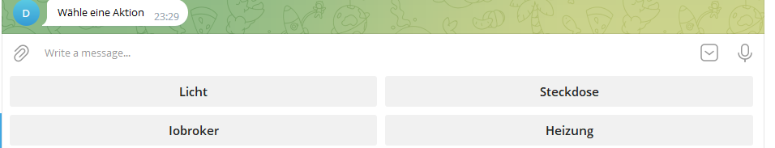
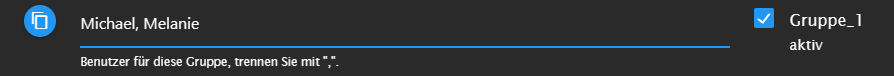
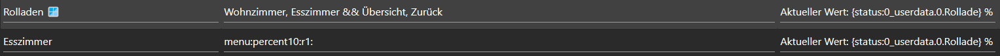
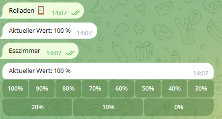
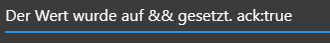
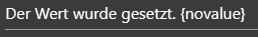
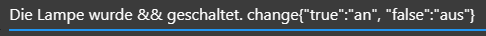
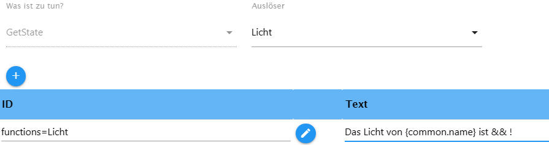
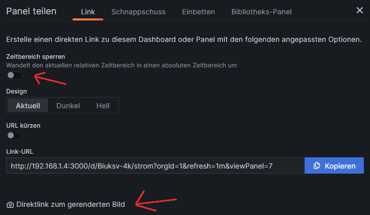

## ioBroker telegram-menu adapter

Erstelle ganz einfach Telegrammmenüs
Der Adapter dient dazu per Telegrammenu mit dem Iobroker kommunizieren, Datenpunkt zu schalten oder Werte von Datenpunkte abzufragen. Hierzu kann man verschiedene Gruppen erstellen in denen man Menus erstellen kann. Diese kann man dann Benutzer zuordnen.

Let´s get started!

### Navigation


Hier sieht man den Anfang der Navigation, Zeile 1 (grün) ist die Startnavigation, diese wird gesendet wenn der Adapter gestartet bzw. neu gestartet wird.
Ab Zeile 2 sind dann aufrufbare Menus. Der Text auf der rechten Seite "Wähle eine Aktion" ist frei wählbar darf aber nicht leer sein.
Wie man sieht werden die Buttons in einer Reihe mit einem `Komma` getrennt, um eine neue Zeile mit Buttons zu füllen nutzt man das `&&` als Trenner.


Hier das gesendete Menu in Telegram. Wenn ich jetzt z.B. auf Heizung drücke wird "Heizung" als Text an den Adapter gesendet, dieser sucht nach dem passenden Call Text, dieser muss genau so geschrieben sein, siehe im oberen Bild.
**Ganz wichtig, jede Bezeichnung des Call Text darf nur einmal vorkommen, d.h. er muss einzigartg sein**



-   Alle Benutzer müssen genau so geschrieben werden, wie sie in Telegram erstellt wurden. User werden durch ein `,` getrennt. **Es ist zwingend notwenig das hier ein Name eingetragen wird.**

-   Es können verschiedene vordefinierte Untermenus verwendet werden, z.B. on-off , Prozent oder Nummern für z.B. die Rolladensteuerung, hierzu wird in den Aktionen automatosch ein neuer Trigger erstellt, aber dazu unten mehr.

-   Man kann von einem Menu in ein anderes menu springen. Macht Sinn wenn ein zwei Personen Menu 1 zusammen haben, aber User1 ein weiteres Menu bekommen soll, auf welches User2 keinen Zugriff haben soll. Bei beiden wäre dieser entsprechende Button zu sehen, nur bei User1 mit einer Funktion. Hierzu muss in beiden Gruppen der entsprechende User angegeben sein.
    <br>
    Das ist das erste Menu, hier wird das Menu beim Adapterstart gesendet
    <br>
    Das ist das zweite Menu, damit dieses funktioniert muss der Call Text der Startseite deaktiviert werden. Dieses kann man erreichen indem man einfach ein `-` einträgt.
    Jetzt kann User Michael von Menu1 auf Menu2 zugreifen indem er auf Button Licht drückt, über den neu erscheinenden Button Startseite kommt man ins Menu1 zurück. **Wichtig!! Auch wenn es zwei Menus sind, darf jeder Call Text nur einmal vorkommen!** Bei zwei Menus die nicht den gleichen User haben, darf natürlich jedes Menu einen Eintrag z.B. Licht haben, aber nicht wenn von einem zum anderen gesprungen wird.

-   **Verlauf löschen:** Um alle Nachrichten zu löschen (ähnlich "Verlauf löschen" im Client) fügt man bei einem Menupunkt `menu:deleteAll:Navigation` - **Navigation** ist der Menu-Name, der anschliessend aufgerufen werden soll (z.b. Startmenu)


#### Status

Um den Status einer ID anzuzeigen, beim Aufruf einer Navigation oder eines Submenus, kann folgender Eintrag im Textfeld genutzt werden.

Das Ergebnis wäre dann dieses!


### SetState


-   Die Checkbox Schalten rechts, schaltet nur booleans, es wechselt zwischen true und false beim aufrufen des Auslösers. Der Auslöser hat genau den Namen, wie der Button der die Aktion triggern soll.
-   Unter Wert kann man andere Werte eintragen, damit diese gesetzt werden, für jeden Wert muss ein seperates Setstate erstellt werden
-   Es ist möglich sich das Setzen des Wertes bestätigen zu lassen, **sobald `ack:true`gesetzt wurde**. Platzhalter für den Wert ist &&. Grundsätzlich werde alle states mit `ack:false` gesetzt ,dieses ist grundsätzlich erforderlich wenn man damit Adapter steuern möchte. Eine Bestätigung erfolgt immer erst dann wenn der angesprochene Adapter den Wert auf ack:true gesetzt hat. Möchte man aber `ack:true` manuell setzen, trägt man dieses einfach in den Rückgabetext ein.<br>
    <br>
    Wenn man den gesetzten Wert nicht mit geschickt bekommen möchte, trägt man in den Rückgabetext einfach `{novalue}` ein<br>
    <br>
-   Möchte man Values verändern die als Rückgabetext geschickt werden, z.B. von true zu an und false zu aus ,trägtman im Text `change{"true":"an", "false":"aus"}` ein.<br>
    <br>
-   Möchte man einen State setzen, aber die Änderung eines anderen States danach erhalten, fügt man `{"id":"id","text":"Wert wurde gesetzt:"}` in den Rückgabetext ein. ID durch die gewünschte ID ersetzen, der Text kann auch angepasst werden
    Die Änderung wird aber nur gesendet wenn der State auf ack:true gesetzt wurde

### GetState

-   Mit && als Platzhalter kann man den Wert im Text platzieren, ebenso wie bei setState kann man das Value beinflussen mit `change{"true":"an", "false":"aus"}`.
-   Wenn ich einen Wert aus einem Datenpunkt auslesen möchte, das Value aber umrechnen muss, kann ich in den Rückgabetext `{math:/10}` zum Beispiel wird hier durch 10 geteilt
    <br>
-   Möchte man das Value runden geht folgendes `{round:2}`
-   Wenn man gleichzeitig mit einer Abfrage mehrere Werte abrufen möchte, kann man die Checkbox Newline aktivieren um für jede Abfrage den Rückgabetext in einer neuen Zeile angezeigt zu bekommen.
-   Möchte man einen Wert einen States mit Unix-Zeitstempel zu einer lokalen Zeit umwandeln und gesendet bekommen fügt man in den Rückgabetext `{time}` an der gewünschten Stelle ein

#### Werte aus erstellten Funktionen

-   Um alle Werte der einstellbaren Funktionen zu bekommen, muss man anstatt der ID einfach functions=Licht z.B. schreiben.
-   Wenn man im Ausgabe Text den Namen des Datenpunkts haben möchte trägt man einfach an der gewünschten Position im Text `{common.name}` ein

<br>

### Send Picture

-   In den Einstellungen kann man ein Token für Grafana einfügen
-   Es muss ein Verzeichnis erstellt werden in dem man alle Rechte hat z.B. `/opt/iobroker/grafana/` , um dort die Bilder zwischen speichern zu können
-   In Aktion muss man die Rendering URL angeben, diese findet man in Grafana auf das Diagramm -> teilen -> (Zeitbereich sperren herausnehmen, damit immer das aktuelle Diagramm geschickt wird) -> Direktlink zum gerenderten Bild
-   Wenn man mehrer Diagramm schickt, muss der Filename unterschiedlich sein, da sonst die Bilder sich gegenseitig überschreiben
-   Delay die Zeit zwischen der Anfrage und dem Senden des Bildes -> je nach Geschwindigkeit des Systems kann und muss ein anderer Wert genommen werden

    

### Submenus


-   Die Menus werden in die Navigation eingetragen um sie aufzurufen
-   Der name muss immer ein einzigartiger Name sein, darf also immer nur einmal vorkommen und verweist dann auf den Trigger in Aktion, wo die ID angegeben wird.

```
 menu:switch-on.true-off.false:name:
```

-   Es kann jeder Wert ersetzt werden, on und off sind die Buttons, true und false werden automatisch zu booleans gewandelt, kann aber auch durch Text ersetzt werden

```
menu:percent10:name:
```

-   Die 10 ist variabel und gibt die Schritte an, diese kann einfach durch eine andere Zahl ersetzt werden.

```
menu:number1-20-2-unit:name:
```

-   Die 1,20 gibt die Spanne an, die 2 die Schritte, und Unit die Einheit, alles ist variabel ersetzbar. z.B. `menu:number16-36-4-°C:temperaturXY:`

```
menu:back
```

-   Wechselt zur jeweils davor aufgerufenen Seite zurück, es können maximal 20 Seiten zurück gegangen werden

    <br>
    
    

### Events

Eventlistener: Wartet auf einen Datenpunkt - wird dieser Datenpunkt mit ack=true gesetzt (z.B. über Script oder Adapter), wird ein vordefiniertes Menu geöffnet
