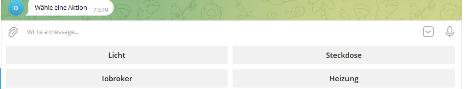
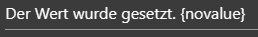
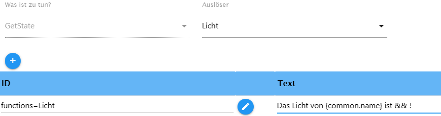
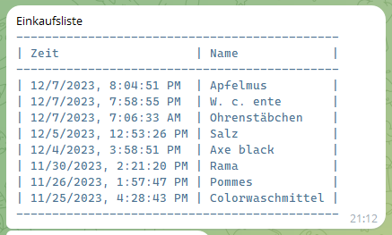
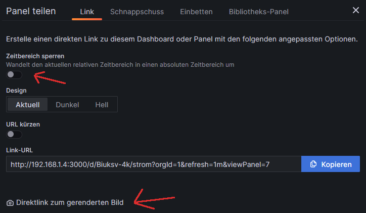

## ioBroker telegram-menu Adapter

Erstelle ganz einfach Telegram-Menüs

Der Adapter dient dazu, per Telegram mit dem ioBroker zu kommunizieren, Datenpunkte zu schalten oder Werte von
Datenpunkten abzufragen. Hierzu können verschiedene Gruppen erstellt werden, in denen man Menüs anlegen kann. Diese lassen sich
dann Benutzern zuordnen.

Let's get started!

### Allgemein

- Spezielle Einstellungen sind direkt im Adapter zu finden und
  dort platziert, wo sie eingesetzt werden können.
  Über diesen Button kann man die Hilfetexte aufrufen: 
- **Wichtig:** Damit das Menü genutzt werden kann, muss unter „Benutzer von Telegram" im Adapter mindestens ein Menü aktiv gesetzt werden. 
  Dazu einfach die Checkbox auf der rechten Seite setzen. 

### Navigation

<br>
Hier sieht man die Navigation.

- Zeile 1 (grün) ist die Startnavigation. Diese wird gesendet, wenn der Adapter gestartet bzw. neu gestartet wird. Man
  kann sie aber jederzeit über einen Button wieder aufrufen.
- Der Text auf der rechten Seite (z. B. „Wähle eine Aktion") ist frei wählbar, darf aber nicht leer sein.
- Buttons in einer Reihe werden mit einem `,` getrennt.
- Eine neue Zeile erreicht man mit dem Trenner `&&`.

<br>
Hier sieht man das gesendete Menü in Telegram. Wenn man z. B. auf „Heizung" drückt, wird „Heizung" als Text an den Adapter
gesendet. Dieser sucht nach dem passenden Call-Text, der exakt so geschrieben sein muss wie im oberen Bild.&nbsp;
**Ganz wichtig: Jede Bezeichnung des Call-Texts darf nur einmal vorkommen, d. h. er muss einzigartig sein.**

- Es können verschiedene vordefinierte Untermenüs verwendet werden, z. B. On-Off, Prozent oder Nummern (etwa für die
  Rollladensteuerung). Hierzu wird in den Aktionen automatisch ein neuer Trigger erstellt – dazu weiter unten mehr.

- Es ist möglich, von einem Menü zu einem anderen Menü zu wechseln. Dies ist sinnvoll, wenn zwei Personen dasselbe Menü
  gemeinsam verwenden, aber User1 ein zusätzliches Menü erhält, auf das User2 keinen Zugriff haben soll. In beiden
  Gruppen ist der entsprechende Button sichtbar, jedoch mit einer Funktionalität, die nur für User1 relevant ist. Damit
  dies funktioniert, muss der jeweilige Benutzer in beiden Gruppen eingetragen sein.
- Damit das zweite Menü (also ein Untermenü) funktioniert, muss der Auslösetext der Startseite deaktiviert werden. Durch
  das Deaktivieren wird die Zeile orange dargestellt, und es erscheint ein Hinweis, dass es sich um ein Untermenü
  handelt. Man deaktiviert die Zeile, indem man die Zelle „Auslösen" leer lässt. In älteren Versionen musste man ein
  `-` eintragen – das funktioniert aber weiterhin. Jetzt kann User1 von Menü 1 auf Menü 2 zugreifen, indem er auf den
  entsprechenden Button drückt.&nbsp;**Wichtig: Auch bei zwei Menüs darf jeder Call-Text nur einmal
  vorkommen!**
- Bei zwei Menüs, die nicht denselben User haben, darf natürlich jedes Menü einen Eintrag wie z. B. „Licht" haben – aber nicht,
  wenn von einem zum anderen gesprungen wird.

#### Soll beim Öffnen einer Navigation ...

##### <span id="status"></span>...ein Status geschickt werden

- Um den Status einer ID beim Aufruf einer Navigation oder eines Submenüs anzuzeigen, kann folgender Eintrag im
  Rückgabetext genutzt werden: `{status:'ID':true}`.
  „ID" muss durch die abzufragende ID ersetzt werden.
  Der Ausdruck muss direkt an der Stelle stehen, an der der Status angezeigt werden soll.
- **_Breaking Change!!!_** Der Parameter `true` gibt an, ob der Wert durch
  `change{"true":"an","false":"aus"}` geändert werden darf. Dies ist wichtig, wenn man mehr als einen
  Status in einem Aufruf abfragen möchte. <br>

##### ... der Wert des Status geändert werden

- Soll der Wert verändert werden, z. B. von `true` zu „an" und `false` zu „aus", kann `change{"true":"an","false":"aus"}` genutzt
  werden.

##### ...ein Wert gesetzt werden

- Setzt beim Öffnen einer Navigation einen Datenpunkt. Folgendes kann genutzt werden: `{set:'id':'ID',val,ack}` – „ID" ist
  die ID des Datenpunkts, in den ein Wert geschrieben werden soll. „val" ist der zu setzende Wert, „ack" gibt an, ob der Wert
  bestätigt oder unbestätigt gesetzt werden soll.

##### ...ein Zeitstempel gesendet werden

- Sendet beim Öffnen einer Navigation einen Zeitstempel.
- Für die letzte Bearbeitung: `{time.lc,(DD MM YYYY hh:mm:ss:sss),id:'ID'}`
- Ansonsten: `{time.ts,(DD MM YYYY hh:mm:ss:sss),id:'ID'}` – „ID" ist die ID des abzufragenden Datenpunkts. In den Klammern
  kann das Format individuell angepasst werden: Einzelne Platzhalter dürfen entfernt, aber nicht umbenannt
  werden. Ausnahme: `YYYY` kann auch als `YY` genutzt werden.

##### ...dem Text einen Zeilenumbruch hinzufügen

- An der gewünschten Stelle `\n` eintragen.

##### ...ist der Statuswert ein Unix-Zeitstempel

- Um diesen in eine lokale Zeit zu konvertieren: `{time}`

##### ...den Parse Mode verwenden

- Wird genutzt, um Text **fett** `<b></b>`, *kursiv* `<i></i>`, als Code `<code></code>` oder als Link `<a href="URL">Link</a>` darzustellen. Es ist möglich, dass weitere Tags unterstützt werden.
- Um dies zu nutzen, die Checkbox „Parse Mode" aktivieren und den Text zwischen die Tags einfügen.

#### Icons in den Menü-Buttons


- Möchte man spezielle Icons in den Menü-Buttons haben, kopiert man sich ein Emoji
  (z. B. von https://www.getemojis.net/html/#Emoji-Liste) und setzt es wie ein Schriftzeichen ein, oder man nutzt ganz einfach
  `Windows + .`. Es wird nicht der Code des Emojis kopiert, sondern das Emoji direkt!


#### Verlauf löschen

Um alle Nachrichten zu löschen (ähnlich „Verlauf löschen" im Client), fügt man bei einem Menüpunkt
`menu:deleteAll:Navigation` ein.&nbsp;**Navigation**&nbsp; ist der Menü-Name, der anschließend aufgerufen werden soll (
z. B. Startseite). Es können nur Einträge gelöscht werden, die jünger als 48 Stunden sind.

### Submenüs


- Die Menüs werden in die Navigation eingetragen, um sie aufzurufen.
- Der TRIGGER muss immer ein einzigartiger Name sein, darf also nur einmal vorkommen, und verweist auf den
  Trigger in der Aktion, wo die ID angegeben wird.

```
 menu:switch-on.true-off.false:TRIGGER:
```

- Es kann jeder Wert ersetzt werden. „on" und „off" sind die Button-Beschriftungen. „true" und „false" werden automatisch zu Booleans
  umgewandelt, können aber auch durch Text ersetzt werden.

```
menu:percent10:TRIGGER:
```

- Die `10` ist variabel und gibt die Schrittweite an. Sie kann einfach durch eine andere Zahl ersetzt werden.

```
menu:number1-20-2-unit:TRIGGER:
```

- `1` und `20` geben die Spanne an (kann auch umgekehrt sein: `20-1`), `2` die Schrittweite. Für einen negativen Wert einfach
  `(-)` vor die Zahl schreiben. „unit" ist die Einheit. Alles ist variabel ersetzbar, z. B.
  `menu:number16-36-4-°C:temperaturXY:`

```
menu:dynSwitch[Name1|value1, Name2|value2, value3]:TRIGGER:LengthOfRow:
```

- Hiermit kann ein dynamisches Menü erzeugt werden. In einem Array `[]` steht immer der anzuzeigende Name und der Wert
  (`Name|Wert`). Alternativ nur der Wert – dann wird der Button mit dem Wert beschriftet. `LengthOfRow` gibt an, wie viele Buttons nebeneinander stehen sollen. **_Breaking Change!!!_** &nbsp; Bitte manuell ändern:
  `[Name1:Value1, Name2:Value2]` ändern zu `[Name1|Value1, Name2|Value2]`. Jetzt können auch Dezimalzahlen als Value
  genutzt werden, z. B. `2.5`.
  Als Name kann jetzt auch ein Wert eines Datenpunkts genutzt werden: `{status:'ID':true}` – <a href="#status">für weitere
  Infos siehe hier</a>.

```
menu:back
```

- Wechselt zur jeweils zuvor aufgerufenen Seite zurück. Es können maximal 20 Seiten zurückgegangen werden.

  <br>
  
  

### SetState


- Die Checkbox „Schalten" rechts schaltet nur Booleans. Es wechselt zwischen `true` und `false` beim Aufrufen des Auslösers.
  Der Auslöser hat exakt den Namen des Buttons, der die Aktion triggern soll.
- Unter „Wert" kann man andere Werte eintragen, die gesetzt werden sollen. Für jeden Wert muss ein separater SetState-Eintrag
  erstellt werden.
- Es ist möglich, sich das Setzen des Wertes bestätigen zu lassen,&nbsp;**sobald `ack:true` gesetzt wurde**. Der Platzhalter
  für den Wert ist `&&`. Grundsätzlich werden alle States mit `ack:false` gesetzt – dies ist erforderlich,
  wenn man damit andere Adapter steuern möchte. Eine Bestätigung erfolgt erst, wenn der angesprochene Adapter den
  Wert auf `ack:true` gesetzt hat. Möchte man `ack:true` manuell setzen, setzt man einfach den Haken bei „Ack".<br>

---

```
{novalue}
```

- Wenn man den gesetzten Wert nicht mitgeschickt bekommen möchte, wird dies im Rückgabetext eingetragen.<br>
  <br>

---

- Setzt man einen State und möchte die Änderung eines anderen States erhalten, nutzt man Folgendes im Rückgabetext.
  „ID" durch die gewünschte ID ersetzen. Der Text kann ebenfalls angepasst werden.
  Die Änderung wird nur gesendet, wenn der State auf `ack:true` gesetzt wurde.

## Hinweis — hier hat sich eine Änderung ergeben
Die Änderung sollte in den meisten Fällen automatisch übernommen worden sein. Bitte kontrolliert, ob es wie gewünscht funktioniert.

### Neu
```
 {"foreignId":"id","text":"Wert wurde gesetzt:"} 

```

<details>
  <summary>Alte Version anzeigen (ausklappbar)</summary>

### Alte (veraltet)
```
 {'id':'ID','text':'Wert wurde gesetzt:'} 
```
</details>
---

```
{setDynamicValue:RequestText:Type:ConfirmText:ID:}
```

- **Einen Text- oder Zahl-Datenpunkt setzen:**&nbsp;Möchte man z. B. einen Text in einen Datenpunkt schreiben, wartet die
  Instanz nach Drücken des Buttons auf eine Eingabe. Anschließend wird der ausgewählte Datenpunkt mit dem eingegebenen Text
  beschrieben. Eingetragen wird dies im Rückgabefeld.
    - **RequestText** – Aufforderungstext zur Eingabe
    - **Type** – `boolean`, `number` oder `string`
    - **ConfirmText** – Bestätigungstext nach dem Setzen des Datenpunkts, kann mit eigenem Text ersetzt werden.
    - **ID** – Optional: ID eines anderen Datenpunkts, dessen Bestätigungswert im Rückgabetext angezeigt wird. Es werden nur Werte mit `ack:true` gesendet. Platzhalter für den Wert ist `&&`.
---

```
{confirmSet:The value has been set:noValue}
```

- Hiermit kann das Setzen eines Wertes bestätigt werden. Dies bedeutet jedoch nicht, dass ein Adapter diesen Wert
  auch tatsächlich verarbeitet hat.

---

##### Parse Mode, change, newline

- Siehe Abschnitt [Navigation](#navigation).

#### Einen Wert von einem Submenü beeinflussen

- Um dies zu erreichen, einfach das Submenü wie gewohnt erstellen. Dann bei SetState als Wert den statischen Teil
  einfügen und als Platzhalter für den Wert aus dem Submenü `{value}` setzen.

#### Einen statischen Wert mit einem dynamischen Wert einer ID setzen

- Man kann im Wert einen statischen Teil definieren und davor, dazwischen oder dahinter einen
  dynamischen Teil einfügen. Der dynamische Teil sieht so aus: `{id:ID}`, wobei „ID" durch die gewünschte ID ersetzt werden muss.
 
#### Hier ein paar Beispiele

Eingabe – der Datenpunkt hat in diesem Fall den Wert `true` oder `false`:
 ```
{id:0_userdata.0.Fenster.Fenster_Status} 
```
Ausgabe:

 ```
true 
```

Eingabe – der Datenpunkt hat den Wert `5`, dieser wird mit 2 multipliziert:
 ```
{id:0_userdata.0.Count} {math:*2} 
```
Ausgabe:

 ```
10
```

Eingabe – der Datenpunkt hat den Wert `5`, wird mit 2 multipliziert, mit zusätzlichem Text:
 ```
Test {id:0_userdata.0.Count} {math:*2} Test 
```
Ausgabe – das Ergebnis wird immer hinten angehängt, es sei denn, man nutzt den Platzhalter `&&`:

 ```
Test Test 10
```

Eingabe – mit Platzhalter `&&`:
 ```
Test && {id:0_userdata.0.Count} {math:*2} Test  Oder Test && Test {id:0_userdata.0.Count} {math:*2}
```

Ausgabe – der Platzhalter wird durch das Ergebnis ersetzt:

 ```
Test 10 Test
```

Eingabe – man kann das Ergebnis auch austauschen. Der Datenpunkt hat immer noch den Wert `5`:
 ```
Status &&  {id:0_userdata.0.Count} {math:*2} change{"10":"an", "20":"aus"}
```

Ausgabe – der Platzhalter wird durch den ausgetauschten Wert ersetzt:

 ```
Status an
```
---
### GetState

- Mit `&&` als Platzhalter kann man den Wert im Text platzieren. Ebenso wie bei SetState kann man den Wert beeinflussen
  mit `change{"true":"an", "false":"aus"}`.
- Wenn man einen Wert aus einem Datenpunkt auslesen und umrechnen muss, kann man im Rückgabetext
  `{math:/10}` einfügen – hier wird z. B. durch 10 geteilt.
  <br>
- Möchte man den Wert runden, geht das mit `{round:2}`.
- Wenn man gleichzeitig mehrere Werte abrufen möchte, kann man die Checkbox „Newline" aktivieren, um für
  jede Abfrage den Rückgabetext in einer neuen Zeile angezeigt zu bekommen.
- Möchte man einen Unix-Zeitstempel in eine lokale Zeit umwandeln, fügt man
  im Rückgabetext `{time}` an der gewünschten Stelle ein.

#### Werte aus erstellten Funktionen

- Um alle Werte einer konfigurierten Funktion abzurufen, schreibt man anstatt der ID einfach `functions=Licht` (Beispiel).
- Wenn man im Ausgabetext den Namen des Datenpunkts anzeigen möchte, trägt man an der gewünschten Position im Text
  `{common.name}` ein.

<br>

- **Tabellen**<br>
  **_Breaking Change!!!_**

Die Art der Eingabe hat sich geändert. Es muss ab jetzt valides JSON sein, damit die Tabelle korrekt angezeigt werden kann.

  `{"tableData":[{"key":"value-1-inJSON","label":"Name"},{"key":"value-2-inJSON","label":"NameTH-Col1"}],"tableLabel":"ShoppingList","type":"TextTable"}`

 Ein JSON als TextTable anzeigen lassen: 
1. Unter „ID" einen Datenpunkt auswählen, der ein JSON enthält. 
2. Im Textfeld das JSON wie oben beschrieben eingeben und anpassen.
   In `tableData` ist der `key` gleich dem Schlüssel aus dem JSON.
   `label` ist der Name der Tabellenspalte. Wird er weggelassen, wird der `key` als Spaltenname genutzt.
3. `tableLabel` ist die Überschrift der Tabelle. Sie kann auch ein leerer String sein – dann wird keine Überschrift angezeigt.
4. `type` ist die Art der Tabelle und muss unverändert bleiben.

`
{"tableData":[{"key":"name"}],"tableLabel":"ShoppingList","listName":"SHOP","type":"alexaShoppingList"}
`

- Dies erstellt eine Liste mit Buttons für den `alexa-shoppinglist`-Adapter. Die Buttons entfernen das jeweilige Item aus der Liste des Alexa2-Adapters. Der `key` für die Daten aus dem JSON ist in diesem Fall `name`. Damit das Ganze funktioniert, muss
  der verwendete Datenpunkt vom `alexa-shoppinglist`-Adapter stammen.
- `listName` ist der Name der Liste, die in Alexa angelegt wurde, z. B. `SHOP` oder `TOBUY`. Dieser muss mit der Liste übereinstimmen, von der die Daten abgerufen werden.




### Send Picture

- In den Einstellungen kann man ein Token für Grafana einfügen.
- Es muss ein Verzeichnis mit vollen Schreibrechten erstellt werden, z. B. `/opt/iobroker/grafana/`, um dort die
  Bilder zwischenspeichern zu können.
- In der Aktion muss die Rendering-URL angegeben werden. Diese findet man in Grafana unter: Diagramm → Teilen → (Zeitbereich
  sperren deaktivieren, damit immer das aktuelle Diagramm geschickt wird) → Direktlink zum gerenderten Bild.
- Wenn man mehrere Diagramme schickt, muss der Dateiname unterschiedlich sein, da sich die Bilder sonst gegenseitig
  überschreiben.
- **Neuerung:** Ab jetzt kann man das Delay auf `0` setzen, um das Bild ohne Verzögerung zu verschicken. 
- Bei einem Delay > 0 wird das Bild um den angegebenen Wert (in Sekunden) verzögert verschickt.

  </img>

### Send Location

- Als Erstes den Trigger auswählen.
- Dann muss ein Datenpunkt für den Breitengrad (`latitude`) und einer für den Längengrad (`longitude`) angegeben werden.

### Events

- Integrierter Eventlistener: Wartet auf einen Datenpunkt – wird dieser gesetzt (z. B. über ein Script oder einen
  Adapter), wird ein vordefiniertes Menü geöffnet.
- Es wird auf die angegebene Bedingung geprüft.
- Ab Version > 1.7.3 kann man `=`, `!=`, `<`, `>`, `<=`, `>=` als Bedingung auswählen. Ist nichts ausgewählt, wird
  standardmäßig auf Gleichheit geprüft.
- Es wird auf `ack` geprüft.

### Echarts

- Hiermit ist es möglich, sich Diagramme direkt aus dem Echarts-Adapter schicken zu lassen.
- **Preset** kann direkt aus der Objektstruktur übernommen werden.
- **Background** – hier kann der Hintergrund eingestellt werden.
- **Theme** – es können verschiedene Themes aus dem Echarts-Adapter eingestellt werden, z. B.
  `auto, default, dark, dark-bold, dark-blue, gray, vintage, macarons, infographic, shine, roma, azul, blue, royal, tech-blue, red, red-velvet, green`.
- **Dateiname** – individueller Dateiname.&nbsp;**Wichtig: In den Einstellungen muss ein Verzeichnis mit
  voller Schreibberechtigung angegeben sein.**

### HTTP Request

- Hiermit ist es möglich, einen HTTP-Request abzusenden – mit oder ohne Authentifizierung. Als Erstes muss die URL
  angegeben werden. User und Passwort sind optional; wenn nicht benötigt, einfach leer lassen. Als Dateiname
  kann der vorkonfigurierte Name stehen bleiben.

### Settings

- **Telegram-Instanz** – hier kann man zwischen den Instanzen wählen, wenn man mehrere installiert hat.
- **Text bei keinem Eintrag** – Der eingetragene Text wird gesendet, wenn kein passender Menü-Eintrag gefunden wurde. Dies kann durch die Checkbox daneben deaktiviert werden.
- **Resize Keyboard** – Fordert Clients auf, die Größe der Tastatur vertikal anzupassen, um eine optimale Passform zu
  gewährleisten (z. B. die Tastatur kleiner zu machen, wenn nur zwei Tastenreihen vorhanden sind). Standardwert:
  `false` – die benutzerdefinierte Tastatur hat dann immer die gleiche Höhe wie die Standardtastatur der
  App. [Telegram API](https://core.telegram.org/bots/api#replykeyboardmarkup)
- **One Time Keyboard** – Fordert Clients auf, die Tastatur auszublenden, sobald sie verwendet wird. Die Tastatur bleibt
  weiterhin verfügbar, aber Clients zeigen im Chat automatisch die normale Buchstabentastatur an. Der Benutzer
  kann über eine spezielle Schaltfläche im Eingabefeld die benutzerdefinierte Tastatur wieder einblenden. Standardwert:
  `false`. [Telegram API](https://core.telegram.org/bots/api#replykeyboardmarkup)
- **Token Grafana** – Optional: Token, um Diagramme von Grafana abzurufen.
- **Verzeichnis** – Zum Zwischenspeichern von Diagrammen (wird für Grafana und Echarts benötigt). Es müssen volle
  Schreibrechte für dieses Verzeichnis bestehen.
- **Menü senden nach Neustart** – Kann deaktiviert werden. Bei deaktivierter Option muss das Menü
  beim ersten Mal manuell über das Eingabefeld in der Telegram-App aufgerufen werden.
