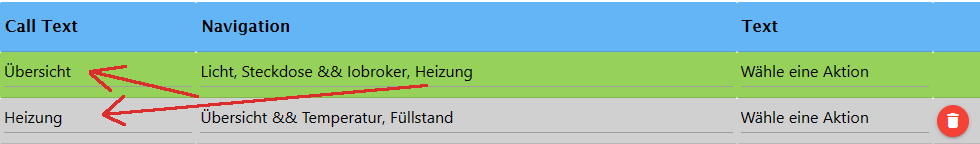

## ioBroker telegram-menu adapter

Erstelle ganz einfach Telegrammmenüs
Der Adapter dient dazu per Telegrammenu mit dem Iobroker zu kommunizieren, Datenpunkt zu schalten oder Werte von Datenpunkte abzufragen. Hierzu kann man verschiedene Gruppen erstellen in denen man Menus erstellen kann. Diese kann man dann Benutzer zuordnen.

Let´s get started!

### Allgemein

-   Alle im Anschluss vorgestellten Submenüs und speziellen Einstellungen sind direkt im Adapter zu finden . Diese Einstellungen sind sortiert und genau dort platziert, wo sie eingesetzt werden können.
    Über diesen Button kann man die "HelperText"aufrufen 

### Navigation

<br>
Hier sieht die Navigation.

-   Zeile 1 (grün) ist die Startnavigation, diese wird gesendet wenn der Adapter gestartet bzw. neu gestartet wird. Man kann dies aber über einen Button wieder aufrufen.
-   Der Text auf der rechten Seite "Wähle eine Aktion" ist frei wählbar, darf aber nicht leer sein.
-   Buttons in einer Reihe werden mit einem `,` getrennt
-   Eine neue Zeile erreicht man mit dem Trenner `&&`.

<br>
Hier, das gesendete Menu in Telegram. Wenn ich jetzt z.B. auf Heizung drücke wird "Heizung" als Text an den Adapter gesendet, dieser sucht nach dem passenden Call Text, dieser muss genau so geschrieben sein, siehe im oberen Bild.&nbsp;
**Ganz wichtig, jede Bezeichnung des Call Text darf nur einmal vorkommen, d.h. er muss einzigartg sein**

-   Es können verschiedene vordefinierte Untermenus verwendet werden, z.B. on-off , Prozent oder Nummern für z.B. die Rolladensteuerung, hierzu wird in den Aktionen automatosch ein neuer Trigger erstellt, aber dazu unten mehr.

-   Es ist möglich, von einem Menü zu einem anderen Menü zu wechseln. Dies ergibt Sinn, wenn zwei Personen dasselbe Menü gemeinsam verwenden, aber wenn User1 ein zusätzliches Menü erhält, auf das User2 keinen Zugriff haben soll. In beiden Gruppen ist der entsprechende Button sichtbar, jedoch mit einer Funktionalität, die nur für User1 relevant ist. Damit dies funktioniert, muss der jeweilige Benutzer in beiden Gruppen spezifiziert sein.
-   Damit das Zweite Menu, also ein Untermenu funktioniert muss der Auslösen Text der Startseite deaktiviert werden. Durch das deaktivieren wird die Zeile in orange dargestellt, und es erscheint auch der Hinweis das es sich um ein Untermenü handelt. Man deaktiviert die Zeile indem man die Zelle Auslösen leer lässt. In den älteren Vesionen musste man ein `-` eintragen, funktioniert aber auch weiterhin damit. Jetzt kann User1 von Menu1 auf Menu2 zugreifen indem er auf den entsprechenden Button drückt.&nbsp;**Wichtig!! Auch wenn es zwei Menus sind, darf jeder Call Text nur einmal vorkommen!**
-   Bei zwei Menus die nicht den gleichen User haben, darf natürlich jedes Menu einen Eintrag z.B. Licht haben, aber nicht wenn von einem zum anderen gesprungen wird.

#### Soll beim Öffnen einer Navigation ...

##### <span id="status"></span>...ein Status geschickt werden

-   Um den Status einer ID anzuzeigen, beim Aufruf einer Navigation oder eines Submenus, kann folgender Eintrag im Textfeld genutzt werden. `{status:'ID':true}`.
    ID - muss durch die abzufragende ID ersetzt werden.
    **_Breaking Change!!!_** der Parameter true dahinter sagt aus oder der Wert geändert werden darf durch `change{"true":"an","false":"aus"}` oder einer modifizierten Version davon. Dieses ist wichtig wenn ich mehr als einen Status in einem Aufruf abfragen möchte, setzte ich den Wert nicht, werden die Werte nicht sauber verarbeitet. <br>

##### ... der Wert des Status geändert werden

-   soll der Wert verändert werden, z.B. von true zu an und false zu aus, kann `change{"true":"an","false":"aus"}` genutzt werden

##### ...ein Wert gesetzt werden

-   setzt beim Öffnen einer Navigation einen Datenpunkt.Folgendes kann genutzt werden - `{set:'id':'ID',val,ack}` - ID ist die ID des Datenpunkts in den ein Wert geschrieben werden soll. val - der zu setzende Wert, ack - soll der Wert bestätigt oder unbestätigt gesetzt werden?

##### ...ein Zeitstempel gesendet werden

-   sendet beim Öffnen einer Navigation einen Zeitstempel
-   für die letzte Bearbeitung `{time.lc,(DD MM YYYY hh:mm:ss:sss),id:'ID'}`
-   ansonsten `{time.ts,(DD MM YYYY hh:mm:ss:sss),id:'ID'}` - ID ist die ID des abzufragenden Datenpunkts, in den Klammern kann es individuell geändert werden, es können einzelne Platzhalter entfernt werden, dürfen aber nicht geändert werden, bis auf YYYY kann auch als YY genutzt werden.

##### ...dem Text einen Zeilenumbruch hinzufügen

-   an der gewünschten Stelle \n eintragen

##### ...ist der Status Wert ein Unix-Zeitstempel

-   um diesen zu konvertieren zu einer lokalen Zeit - `{time}`

##### ...den Parse Mode verwenden

-   wird genutzt um Text fett `<b></b>`, kursiv `<i></i>` also code `<code></code>` oder link `<a href=“URL“>Link</a>` dar zu stellen, es ist möglich das es noch mehr gibt
-   um das zu nutzen checkbox Parse Mode aktivieren und Text zwischen die Tags einfügen

#### Icons in den Menu-Buttons


-   möchte man spezielle Icons in den Menu-buttons haben, kopiert man sich ein Emoji (z.B. https://www.getemojis.net/html/#Emoji-Liste ) und setzt es wie ein Schriftzeichen ein. Es wird nicht der Code des Emoji's kopiert, sondern das Emoji direkt!


#### Verlauf löschen

Um alle Nachrichten zu löschen (ähnlich "Verlauf löschen" im Client) fügt man bei einen Menupunkt `menu:deleteAll:Navigation` -&nbsp;**Navigation**&nbsp; ist der Menu-Name, der anschliessend aufgerufen werden soll (z.b. Startseite), es können nur Einträge gelöscht werden die jünger sind als 48h.

### Submenus


-   Die Menus werden in die Navigation eingetragen um sie aufzurufen
-   Der TRIGGER muss immer ein einzigartiger Name sein, darf also immer nur einmal vorkommen und verweist dann auf den Trigger in Aktion, wo die ID angegeben wird.

```
 menu:switch-on.true-off.false:TRIGGER:
```

-   Es kann jeder Wert ersetzt werden, on und off sind die Buttons, true und false werden automatisch zu booleans gewandelt, kann aber auch durch Text ersetzt werden

```
menu:percent10:TRIGGER:
```

-   Die 10 ist variabel und gibt die Schritte an, diese kann einfach durch eine andere Zahl ersetzt werden.

```
menu:number1-20-2-unit:TRIGGER:
```

-   Die 1,20 gibt die Spanne an, diese kann auch umgedreht sein 20,1, die 2 die Schritte, für einen negativen Wert einfach`(-)` vor die Zahl schreiben , und Unit die Einheit, alles ist variabel ersetzbar. z.B. `menu:number16-36-4-°C:temperaturXY:`

```
menu:dynSwitch[Name1|value1, Name2|value2, value3]:TRIGGER:LenghtOfRow:
```

-   Hiermit kann ein dynamisches Menu erzeugt werden, in einem Array [], immer der anzuzeigende Name und der Wert, Name|Wert, oder alternativ nur der Wert , dann wird der Button mit dem Wert bezeichnet, -LengthOfRow- hiermit kann man angeben wieviele Buttons nebeneinander stehen sollen. **_Breaking Change!!!_** &nbsp; Bitte manuel ändern: `[Name1:Value1, Name2:Value2]` ändern zu `[Name1|Value1, Name2|Value2]`. Jetzt können auch Dezimalzahlen als Value genutzt werden, z.B.(2.5).
Als Name kann jetzt auch ein Wert eines Datenpunkts genutzt werden. `{status:'ID':true}`  <a href="#status">für weitere Infos schaue hier</a>

```
menu:back
```

-   Wechselt zur jeweils davor aufgerufenen Seite zurück, es können maximal 20 Seiten zurück gegangen werden

    <br>
    
    

### SetState


-   Die Checkbox Schalten rechts, schaltet nur booleans, es wechselt zwischen true und false beim aufrufen des Auslösers. Der Auslöser hat genau den Namen, wie der Button der die Aktion triggern soll.
-   Unter Wert kann man andere Werte eintragen, damit diese gesetzt werden, für jeden Wert muss ein seperates Setstate erstellt werden
-   Es ist möglich sich das Setzen des Wertes bestätigen zu lassen,&nbsp;**sobald `ack:true`gesetzt wurde**. Platzhalter für den Wert ist &&. Grundsätzlich werde alle states mit `ack:false` gesetzt ,dieses ist grundsätzlich erforderlich wenn man damit Adapter steuern möchte. Eine Bestätigung erfolgt immer erst dann wenn der angesprochene Adapter den Wert auf `ack:true` gesetzt hat. Möchte man aber `ack:true` manuell setzen, setzt man einfach den Haken bei Ack.<br>

```
{novalue}`
```

-   Wenn man den gesetzten Wert nicht mit geschickt bekommen möchte, wird das in den Rückgabetext eingetragen<br>
    <br>

```
{"id":"id","text":"Wert wurde gesetzt:"}
```

-   Möchte man einen State setzen, aber dann die Änderung eines anderen States erhalten, nutzt man dieses im Rückgabetext. ID durch die gewünschte ID ersetzen, der Text kann auch angepasst werden
    Die Änderung wird aber nur gesendet wenn der State auf ack:true gesetzt wurde

```
{setDynamicValue:RequestText:Type:ConfirmText:}
```

-   **Einen Text- oder Zahl-Datenpunkt setzen:**&nbsp;Möchte man z.b einen Text in einen Datenpunkt setzen, wartet die Instanz nach Drücken eines Buttons auf eine Eingabe. Anschliessend wird der ausgewählte Datenpunkt mit dem Text beschrieben. Erreichen kann man das durch eintragen im Rückgabefeld. "RequestText"-Aufforderungstext zur Eingabe, "Type"-boolean, number, string und "ConfirmText"-Bestätigungstext des Datenpunkt setzen, kann mit eigenen Text ersetzt werden.

```
{confirmSet:The value has been set:noValue}
```

-   hiermit kann das setzen eines Wertes bestätigt werden, dieses bedeutet aber nicht das ein Adapter diesen Wert verarbeitet hat


##### Parse Mode , change, newline

-   bitte in die Navigation schauen

#### Einen Wert von einem Submenu beeinflussen

- Um dieses zu erreichen einfach das Submenu wie gewohnt erstellen. Dann bei SetState als Wert den statischen Teil einfügen und als Platzhalter aus dem Submenu `{value}` setzen.

#### Einen statischen Wert mit einem dynamischen Wert einer ID setzen

- Um dieses zu erreichen kann man Wert einen statischen Teil definieren und davor, dazwischen oder dahinter einen dynamischen Teil. Der dynamische Teil sieht so aus `{id:ID}`, wobei ID durch die gewünschte Id ersetzt werden muss, und der Rest bleibt so. 

### GetState

-   Mit && als Platzhalter kann man den Wert im Text platzieren, ebenso wie bei setState kann man das Value beinflussen mit `change{"true":"an", "false":"aus"}`.
-   Wenn ich einen Wert aus einem Datenpunkt auslesen möchte, das Value aber umrechnen muss, kann ich in den Rückgabetext `{math:/10}` zum Beispiel wird hier durch 10 geteilt
    <br>
-   Möchte man das Value runden geht folgendes `{round:2}`
-   Wenn man gleichzeitig mit einer Abfrage mehrere Werte abrufen möchte, kann man die Checkbox Newline aktivieren um für jede Abfrage den Rückgabetext in einer neuen Zeile angezeigt zu bekommen.
-   Möchte man einen Wert einen States mit Unix-Zeitstempel zu einer lokalen Zeit umwandeln und gesendet bekommen fügt man in den Rückgabetext `{time}` an der gewünschten Stelle ein

#### Werte aus erstellten Funktionen

-   Um alle Werte der einstellbaren Funktionen zu bekommen, muss man anstatt der ID einfach functions=Licht z.B. schreiben.
-   Wenn man im Ausgabe Text den Namen des Datenpunkts haben möchte trägt man einfach an der gewünschten Position im Text `{common.name}` ein

<br>

-   **Tabellen**<br>
    bzw ein JSON anzeigen anzeigen lassen: unter ID einen Datenpunkt auswählen, welches ein JSON enthält. Dazu im TextFeld `{json;[value-1-inJSON:NameTH-Col1,value-2-inJSON:NameTH-Col1];Header;}` eingeben.&nbsp;**Value-1**&nbsp; ist z.B. der erste Key des JSON's, welcher angezeigt werden soll.&nbsp; **NameTH-Col1**&nbsp; vergibt den dazugehörigen Spaltennamen (usw.), Dieser kann auch weg gelassen werden, dann hat die Tabelle keinen Header.&nbsp; **Header**&nbsp; muss ausgefüllt sein und ist die Überschrift für die Tabelle. Ausgabe im Textformat (Parse-Mode deaktiviert): '{json;[value-1-inJSON:NameTH-Col1,value-2-inJSON:NameTH-Col1];Header;TextTable;}'. Die Spaltenzahl ist frei definierbar - dazu z.B. `value-3-inJSON:NameTH-Col3` hinzufügen.

```
{json;[value-1-inJSON:NameTH-Col1,value-2-inJSON:NameTH-Col1];Header;shoppinglist;}
```

-   Dieses erstellt genau die selbe Liste , hierbei haben die Button die Funktion das Item aus der Liste vom Alexa2 Adapter zu entfernen. Der Key für die Daten aus der JSON ist in diesem Fall `name:`.Damit das ganze funktioniert, muss der Datenpunkt von dem die Liste erstellt wurde, der Datenpunkt des `alexa-shoppinglist` Adapter sein.


### Send Picture

-   In den Einstellungen kann man ein Token für Grafana einfügen
-   Es muss ein Verzeichnis erstellt werden in dem man alle Schreibrechte hat z.B. `/opt/iobroker/grafana/` , um dort die Bilder zwischen speichern zu können
-   In Aktion muss man die Rendering URL angeben, diese findet man in Grafana auf das Diagramm -> teilen -> (Zeitbereich sperren herausnehmen, damit immer das aktuelle Diagramm geschickt wird) -> Direktlink zum gerenderten Bild
-   Wenn man mehrer Diagramm schickt, muss der Filename unterschiedlich sein, da sonst die Bilder sich gegenseitig überschreiben
-   Delay die Zeit zwischen der Anfrage und dem Senden des Bildes -> je nach Geschwindigkeit des Systems kann und muss ein anderer Wert genommen werden

    

### Send Location

-   als erstes Trigger auswählen
-   dann muss ein Datenpunkt für den Breitengrad ("latitude") und einer für den Längengrad ("longtitude") angegeben werden

### Events

-   integrierter Eventlistener: Wartet auf einen Datenpunkt - wird dieser Datenpunkt gesetzt (z.B. über Script oder Adapter), wird ein vordefiniertes Menu geöffnet. Es wird auf die Bedingung und auf Ack geprüft, welches man für jedes Event seperat eingeben kann.

### Echarts

-   hiermit ist es möglich sich Diagramme direkt aus dem Echarts Adapter schicken zu lassen.
-   Preset kann direkt aus der Objektstruktur übernommen werden.
-   Background , wie der Name schon sagt kann hier der Hintergrund eingestellt werden
-   Theme, es können verschieden Themes aus dem Echarts Adapter eingestellt werden, z.B.`auto, default, dark, dark-bold, dark-blue, gray, vintage, macarons, infographic, shine, roma, azul, blue, royal, tech-blue, red, red-velvet, green`
-   Dateiname, individueller Dateiname. &nbsp;**Wichtig ist das in den Einstellungen ein Verzeichnis angegeben ist mit voller Schreibberechtigung**

### HTTP Request

-   hiermit ist es möglich einen Http Request ab zu senden, mit und ohne Authentification. Als erstes muss die Url angegeben werden, User und Passwort sind optional, wenn diese nicht benötigt werden einfach leer lassen. Als Dateiname kann der vorkonfiguriert Name stehen bleiben. 


### Settings

-   Telegram-Instanz, hier kann man zischen den Instanzen wählen wenn man mehrere installiert hat
-   Der Text des Input-Feldes "Text wird gesendet, wenn kein Eintrag gefunden wurde!" wird geschickt, wie die Beschreibung schon sagt wenn kein Eintrag gefunden wurde, dieses kann durch die Checkbox daneben deaktiviert werden.
-   Resize Keyboard - Fordert Kunden auf, die Größe der Tastatur vertikal zu ändern, um eine optimale Passform zu gewährleisten (z. B. die Tastatur kleiner zu machen, wenn nur zwei Tastenreihen vorhanden sind). Der Standardwert ist „false“. In diesem Fall hat die benutzerdefinierte Tastatur immer die gleiche Höhe wie die Standardtastatur der App. https://core.telegram.org/bots/api#replykeyboardmarkup
-   One Time Keyboard - Fordert Clients auf, die Tastatur auszublenden, sobald sie verwendet wird. Die Tastatur wird weiterhin verfügbar sein, aber Clients zeigen im Chat automatisch die übliche Buchstabentastatur an – der Benutzer kann eine spezielle Schaltfläche im Eingabefeld drücken, um die benutzerdefinierte Tastatur wieder anzuzeigen. Der Standardwert ist „false“. https://core.telegram.org/bots/api#replykeyboardmarkup
-   Token Grafana - Optional , Token um Diagramm von Grafana ab zu rufen
-   Verzeichnis - um Diagramme zwischen zu speichern, wird für Grafana und auch für Echarts gebraucht, es muss volle Schreibberechtigung für dieses Verzeichnis bestehen
-   Menu senden nach einem Neustart - bzw. nach dem Speichern kann hier deaktiviert werden, gegebenenfalls muss das Menu das erste mal per Eingabe in das Inputfeld in der Telegram-App aufgerufen werden
