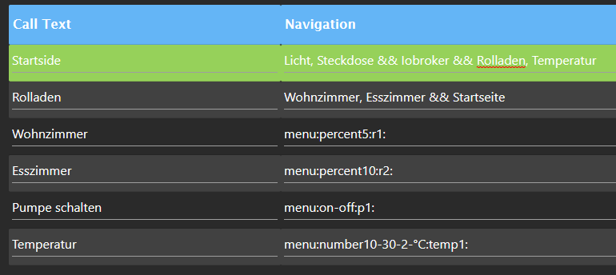

## ioBroker telegram-menu adapter

Easily create Telegram Menus

You can create different groups with separate menus, and then assign users to them.

### Navigation


-   Navigation must be saved for triggers to be updated in actions
-   The call text is called via the button, both must have the same name
-   Buttons must be separated by `,` and lines by `&&`
-   All users must be spelled exactly as they were created in Telegram
-   Each button may only appear once
-   Various predefined submenus can be used, e.g. on-off , yes-no or percentage for e.g. the shutter control
    -   First you create a button in the navigation as usual
    -   Then a new line with the name of the button as call text and in the navigation column you write e.g. `menu:on-off:name:` or `menu:percent10:name:`. **name** must be replaced with a unique name, e.g. shutter1, then save
    -   By saving, a new trigger is created in the actions, you have to select this at SetState and then you look for the appropriate ID that should be set, simply enter a `!` as a value

 -   **Delete history:** To delete all messages (similar to "Delete history" in the client), add a menu item `menu:deleteAll:Navigation` - **Navigation** is the menu name that should then be called up (e.g. start menu)

### SetState

-   Switch only toggles booleans, it switch between true and false
-   If you specify a value, you can set it
-   It is possible to have the setting of the value confirmed, **as soon as `ack:true` is set**.A placeholder for the value is &&. If you do not want the set value to be sent, simply enter `{novalue}` in the return text
-   Changed!!!
    -   To change values which will be ​​sent as return text, like true to on and false to off , write this in the text `change{"true":"on", "false":"off"}`
-   Basically, all states are set with `ack:false`,this is basically necessary if you want to control adapters with it. But if you want to set `ack:true`, you simply enter this in the return text. A confirmation only occurs when the addressed adapter has set the value to ack:true.
-   If you want to set a state, but you want to get the change of another state, you should put this `{"id":"id","text":"Wert wurde gesetzt:"}` in the return text. Replace ID with the wanted ID , and you can also modify the text.
    However, the change is only sent if the state was set to ack:true

-   **Setting a text or number data point:** If you want to set a text in a data point, for example, the instance waits for an input after pressing a button. The selected data point is then described with the text. This can be achieved by setting `{setDynamicValue:RequestText:Type:ConfirmText:}` in the return field. "RequestText": Prompt text for input, "Type": Data type, can be boolean, number, or string and "ConfirmText": Confirmation text for setting the data point, can be replaced with custom text.

  
### GetState

-   You can place the Value in the Text with `&&` as placeholder. You can influence the value with `change{"true":"on", "false":"off"}`, the same as setState
-   Convert value `{math:/10}` for example this shows you to divide by 10
-   Rounds the value for example to 2 decimal places `{round:2}`
-   If you want to retrieve several values ​​at the same time with one query, you can activate the Newline checkbox to have the return text displayed in a new line for each query.
-   If you want to convert a value from a state with a Unix timestamp to a local time and have it sent, insert `{time}` into the return text at the desired location

#### Values ​​from created functions

-   In order to get all the values ​​of the adjustable functions, you simply have to write functions=light e.g. instead of the ID.
-   If you want the name of the data point in the output text, simply enter `{common.name}` at the desired position in the text


### Send Picture

-   in the settings you can add a token for Grafana
-   A directory must be created in which you have all rights, e.g. `/opt/iobroker/grafana/` , in order to be able to save the images there
-   In action you have to specify the rendering URL, this can be found in Grafana on the diagram -> share -> (take out the time range lock so that the current diagram is always sent) -> direct link to the rendered image
-   If you send several diagrams, the file names must be different, otherwise the images will overwrite each other
-   Delay the time between the request and the sending of the image -> depending on the speed of the system, a different value can and must be taken


### Submenus

-   The menus are entered in the navigation in order to call them up
-   The name must always be a unique name, so it can only appear once and then refers to the trigger in action, where the ID is specified.

```
 menu:switch-on.true-off.false:name:
```

-   Any value can be replaced, on and off are the buttons, true and false are automatically converted to booleans, but can also be replaced by text

```
menu:percent10:name:
```

-   The 10 is variable and indicates the steps, this can simply be replaced by another number.

```
menu:number1-20-2-unit:name:
```

-   The 1.20 indicates the span, the 2 the steps, and unit the unit, everything is variably replaceable. e.g. `menu:number16-36-4-°C:temperaturXY:`

```
menu:back
```

-   Goes back to the last page viewed

    <br>
     
    

### Events

Integrated eventlistener: Waits for a data point - if this data point is set with ack=true (e.g. via script or adapter), a predefined menu is opened.   
