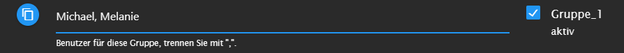
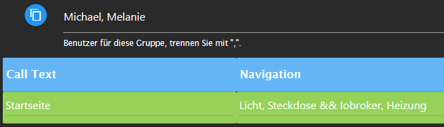
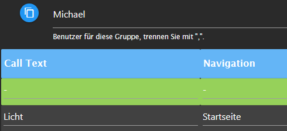
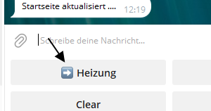

## ioBroker telegram-menu adapter

Easily create Telegram menus
The adapter is used to communicate with the Iobroker via telegram menu, to switch data points or to query values ​​from data points. To do this, you can create different groups in which you can create menus. These can then be assigned to users.

Let's get started!

### Navigation

 Here you can see the beginning of the navigation, line 1 (green) is the start navigation, this is sent when the adapter is started or restarted.
From line 2 onwards there are menus that can be called up. The text on the right "Choose an action" is freely selectable but cannot be empty.
As you can see the buttons are in a row with a`Komma`Separately, you use this to fill a new line with buttons`&&`as a separator.

 Here is the sent menu in Telegram. For example, if I now press heating, "Heating" is sent as a text to the adapter, which looks for the appropriate call text, which must be written exactly like that, see the picture above.**Very important, each name of the call text may only appear once, i.e. it must be unique**

-   All users must be written exactly as they were created in Telegram. Users are activated by a`,`separated.**It is absolutely necessary that a name is entered here.**

-   Various predefined submenus can be used, e.g. on-off, percent or numbers for e.g. the roller shutter control. A new trigger is automatically created in the actions, but more on that below.

-   You can jump from one menu to another menu. Makes sense if two people have Menu 1 together, but User1 should get another menu to which User2 should not have access. This corresponding button would be visible for both, only for User1 with a function. To do this, the corresponding user must be specified in both groups. This is the first menu, here the menu is sent when the adapter starts  This is the second menu, for this to work the call text on the homepage must be deactivated. This can be achieved by simply entering`-`enters.
    Now user Michael can access Menu2 from Menu1 by pressing the Light button. You can return to Menu1 using the new Home button that appears.**Important!! Even if there are two menus, each call text can only appear once!**If there are two menus that do not have the same user, each menu can of course have an entry, e.g. light, but not if you jump from one to the other.

#### delete history

To delete all messages (similar to "Delete history" in the client), add a menu item`menu:deleteAll:Navigation`-**Navigation**is the menu name that should then be called up (e.g. home page)

#### Status

To display the status of an ID when calling up a navigation or a submenu, the following entry in the text field can be used. The result would then be this! 

#### Icons in den Menu-Buttons

If you want to have special icons in the menu buttons, copy an emoji (e.g.<https://www.getemojis.net/html/#Emoji-Liste>) and uses it like a character. The code of the emoji is not copied, but the emoji directly!

### Sub-menus

-   The menus are entered into the navigation in order to call them up
-   The name must always be a unique name, so it can only appear once and then refers to the trigger in action, where the ID is specified.

     menu:switch-on.true-off.false:name:

-   Any value can be replaced, on and off are the buttons, true and false are automatically converted to booleans, but can also be replaced with text

    menu:percent10:name:

-   Die 10 ist variabel und gibt die Schritte an, diese kann einfach durch eine andere Zahl ersetzt werden.

    menu:number1-20-2-unit:name:

-   The 1.20 indicates the range, the 2 the steps, and the unit the unit, everything can be replaced variably. e.g.`menu:number16-36-4-°C:temperaturXY:`

    menu:back

-   Goes back to the previous page, you can go back a maximum of 20 pages

     
    
    

### SetState

-   The Switch checkbox on the right only switches booleans, it switches between true and false when calling the trigger. The trigger has exactly the same name as the button that is supposed to trigger the action.
-   You can enter other values ​​under Value so that they can be set; a separate set state must be created for each value
-   It is possible to have the setting of the value confirmed,**as soon as`ack:true`was set**. Placeholder for the value is &&. Basically all states will be included`ack:false`set, this is basically necessary if you want to control adapters with it. A confirmation only occurs when the addressed adapter has set the value to ack:true. But you would like to`ack:true`If you set it manually, you simply enter it in the return text.  If you don't want to receive the set value, simply enter it in the return text`{novalue}`a  
-   If you want to change values ​​that are sent as return text, e.g. from true to on and false to off, you enter them in the text`change{"true":"an", "false":"aus"}`a.  
-   If you want to set a state but then receive the change of another state, you add`{"id":"id","text":"Wert wurde gesetzt:"}`in the return text. Replace ID with the desired ID, the text can also be customized
    However, the change is only sent if the state was set to ack:true
-   **To set a text or number data point:**For example, if you want to put text in a data point, the instance waits for an input after pressing a button. The selected data point is then described with the text. This can be achieved by setting`{setDynamicValue:RequestText:Type:ConfirmText:}`in the return field. "RequestText" prompt text for input, "Type" boolean, number, string and "ConfirmText" confirmation text of the data point can be replaced with your own text.

### GetState

-   With && as a placeholder you can place the value in the text, just like with setState you can influence the value`change{"true":"an", "false":"aus"}`.
-   If I want to read a value from a data point, but have to convert the value, I can put it in the return text`{math:/10}`for example, here we divide by 10 
-   If you want to round the value, do the following`{round:2}`
-   If you want to retrieve several values ​​at the same time with one query, you can activate the Newline checkbox to have the return text displayed in a new line for each query.
-   If you want to convert a value from a state with a Unix timestamp to a local time and have it sent, add it to the return text`{time}`at the desired location

#### Values ​​from created functions

-   To get all the values ​​of the adjustable functions, you simply have to write functions=light instead of the ID, for example.
-   If you want to have the name of the data point in the output text, simply enter it at the desired position in the text`{common.name}`a

 

-   **The table** or display a JSON: under ID select a data point that contains a JSON. In the text field`{json;[value-1-inJSON:NameTH-Col1,value-2-inJSON:NameTH-Col1];Header;}`input.**Value-1**is, for example, the first key of the JSON that should be displayed.**NameTH-Col1**assigns the corresponding column name (etc.).**Header**must be filled out and is the heading for the table. Output in text format (parse mode disabled): '{json;[value-1-in JSON:NamaTH-Col1,value-2-in JSON:NamaTH-Col1];Header;TextTable;}'. Die Spaltenzahl ist frei definierbar - dazu z.B. `value-3-inJSON:NameTH-Col3`add.

### Send Picture

-   You can insert a token for Grafana in the settings
-   A directory must be created in which you have all rights, e.g.`/opt/iobroker/grafana/`to be able to temporarily save the images there
-   In action you have to specify the rendering URL, which can be found in Grafana on the diagram -> share -> (remove lock time range so that the current diagram is always sent) -> direct link to the rendered image
-   If you send several diagrams, the file name must be different, otherwise the images will overwrite each other
-   Delay is the time between the request and the sending of the image -> depending on the speed of the system, a different value can and must be used

    

### Events

-   Integrated event listener: Waits for a data point - if this data point is set with ack=true (e.g. via script or adapter), a predefined menu is opened.
