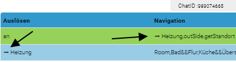
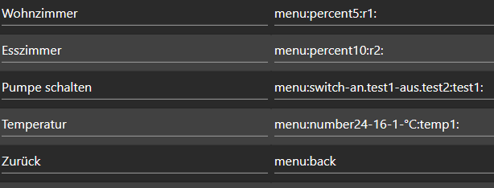
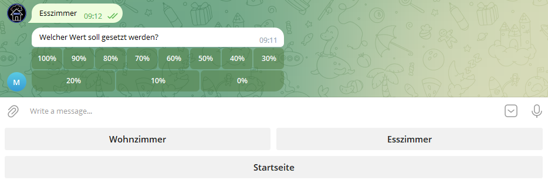
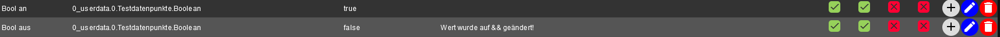
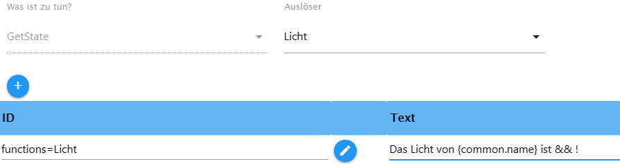

## ioBroker telegram-menu adapter

Easily create Telegram menus
The adapter is used to communicate with the Iobroker via telegram menu, to switch data points or to query values ​​from data points. To do this, you can create different groups in which you can create menus. These can then be assigned to users.

Let's get started!

### Generally

-   All submenus and special settings presented below can be found directly in the adapter. These settings are sorted and placed exactly where they can be used.
    You can use this button to call up the “HelperText”.

### Navigation

 Here the navigation looks.

-   Line 1 (green) is the start navigation, this is sent when the adapter is started or restarted. But you can call this up again using a button.
-   The text on the right "Choose an action" is freely selectable, but cannot be empty.
-   Buttons in a row are marked with a`,`separated
-   A new line can be reached with the separator`&&`.

 Here, the menu sent in Telegram. For example, if I now press heating, "Heating" is sent as a text to the adapter, which looks for the appropriate call text, which must be written exactly like that, see the picture above. **Very important, each name of the call text may only appear once, i.e. it must be unique**

-   Various predefined submenus can be used, e.g. on-off, percent or numbers for e.g. the roller shutter control. A new trigger is automatically created in the actions, but more on that below.

-   It is possible to switch from one menu to another menu. This makes sense when two people share the same menu, but when User1 is given an additional menu that you don't want User2 to have access to. The corresponding button is visible in both groups, but with functionality that is only relevant for User1. For this to work, the respective user must be specified in both groups.

-   In order for the second menu, i.e. a submenu, to work, the call text on the home page must be deactivated. This is achieved by using a`-`enters. Now User1 can access Menu2 from Menu1 by pressing the corresponding button. **Important!! Even if there are two menus, each call text can only appear once!**

-   If there are two menus that do not have the same user, each menu can of course have an entry, e.g. light, but not if you jump from one to the other.

#### When opening a navigation...

##### ...a status will be sent

-   To display the status of an ID when calling up a navigation or a submenu, the following entry in the text field can be used.`{status:'id':'ID':true}`.
    ID - must be replaced by the ID to be queried, the parameter behind it says true or the value can be changed by`change{"true":"an","false":"aus"}`or a modified version thereof. This is important if I want to query more than one status in one call. If I don't set the value, the values ​​will not be processed cleanly. 

##### ... the value of the status can be changed

-   If the value is to be changed, e.g. from true to on and false to off, can`change{"true":"an","false":"aus"}`be used

##### ...a value can be set

-   sets a data point when opening a navigation. The following can be used -`{set:'id':'ID',val,ack}`- ID is the ID of the data point into which a value is to be written. val - the value to be set, ack - should the value be set confirmed or unconfirmed?

##### ...a timestamp will be sent

-   sends a timestamp when opening a navigation
-   for final processing`{time.lc,(DD MM YYYY hh:mm:ss:sss),id:'ID'}`
-   otherwise`{time.ts,(DD MM YYYY hh:mm:ss:sss),id:'ID'}`- ID is the ID of the data point to be queried, it can be changed individually in the brackets, individual placeholders can be removed but may not be changed, except for YYYY can also be used as YY.

##### ...add a line break to the text

-   Enter \\n at the desired location

##### ...the status value is a Unix timestamp

-   to convert this to a local time -`{time}`

##### ...use parse mode

-   is used to make text bold`<b></b>`, italics`<i></i>`also code`<code></code>`or link`<a href=“URL“>Link</a>`To show, it is possible that there are more
-   to use the checkbox Enable Parse Mode and insert text between the tags

#### Icons in den Menu-Buttons

-   If you want to have special icons in the menu buttons, copy an emoji (e.g.<https://www.getemojis.net/html/#Emoji-Liste>) and uses it like a character. The code of the emoji is not copied, but the emoji directly!

#### delete history

To delete all messages (similar to "Delete history" in the client), add a menu item`menu:deleteAll:Navigation`- **Navigation** is the menu name that should then be called up (e.g. home page)

### Sub-menus

-   The menus are entered into the navigation in order to call them up
-   The TRIGGER must always be a unique name, so it can only appear once and then refers to the trigger in action, where the ID is specified.

     menu:switch-on.true-off.false:TRIGGER:

-   Any value can be replaced, on and off are the buttons, true and false are automatically converted to booleans, but can also be replaced with text

    menu:percent10:TRIGGER:

-   The 10 is variable and indicates the steps; this can easily be replaced by another number.

    menu:number1-20-2-unit:TRIGGER:

-   The 1.20 indicates the range, this can also be reversed to 20.1, the 2 the steps, and Unit the unit, everything can be replaced variably. e.g.`menu:number16-36-4-°C:temperaturXY:`

    menu:dynSwitch[Name1|value1, Name2|value2, value3]:TRIGGER:LenghtOfRow:

-   This can be used to create a dynamic menu, in an array \[], always the name to be displayed and the value, Name|Value, or alternatively just the value, then the button is designated with the value, -LengthOfRow- with this you can specify how many buttons should stand next to each other.**_Breaking Change!!!_** Please change manually:`[Name1:Value1, Name2:Value2]`change to`[Name1|Value1, Name2|Value2]`. Decimal numbers can now also be used as values, e.g. (2.5).

    menu:back

-   Goes back to the previous page, you can go back a maximum of 20 pages

     
    
    

### SetState

-   The Switch checkbox on the right only switches booleans, it switches between true and false when calling the trigger. The trigger has exactly the same name as the button that is supposed to trigger the action.
-   You can enter other values ​​under Value so that they can be set; a separate set state must be created for each value
-   It is possible to have the setting of the value confirmed, **as soon as`ack:true`was set**. Placeholder for the value is &&. Basically all states will be included`ack:false`set, this is basically necessary if you want to control adapters with it. Confirmation only occurs when the addressed adapter has set the value`ack:true`has set. But you would like to`ack:true`If you set it manually, you simply check the box next to Ack. 

    {novalue}`

-   If you do not want to receive the set value, this will be entered in the return text  

    {"id":"id","text":"Wert wurde gesetzt:"}

-   If you want to set a state but then receive the change to another state, you use this in the return text. Replace ID with the desired ID, the text can also be customized
    However, the change is only sent if the state was set to ack:true

    {setDynamicValue:RequestText:Type:ConfirmText:}

-   **To set a text or number data point:** For example, if you want to put text in a data point, the instance waits for an input after pressing a button. The selected data point is then described with the text. You can do this by entering it in the return field. "RequestText" prompt text for input, "Type" boolean, number, string and "ConfirmText" confirmation text of the data point can be replaced with your own text.

    {confirmSet:The value has been set:noValue}

-   This can be used to confirm the setting of a value, but this does not mean that an adapter has processed this value

##### Parse Mode , change, newline

-   please look in the navigation

### GetState

-   With && as a placeholder you can place the value in the text, just like with setState you can influence the value`change{"true":"an", "false":"aus"}`.
-   If I want to read a value from a data point, but have to convert the value, I can put it in the return text`{math:/10}`for example, here we divide by 10 
-   If you want to round the value, do the following`{round:2}`
-   If you want to retrieve several values ​​at the same time with one query, you can activate the Newline checkbox to have the return text displayed in a new line for each query.
-   If you want to convert a value from a state with a Unix timestamp to a local time and have it sent, add it to the return text`{time}`at the desired location

#### Values ​​from created functions

-   To get all the values ​​of the adjustable functions, you simply have to write functions=light instead of the ID, for example.
-   If you want to have the name of the data point in the output text, simply enter it at the desired position in the text`{common.name}`a

 

-   **The table** or display a JSON: under ID select a data point that contains a JSON. In the text field`{json;[value-1-inJSON:NameTH-Col1,value-2-inJSON:NameTH-Col1];Header;}`input. **Value-1** is, for example, the first key of the JSON that should be displayed. **NameTH-Col1** assigns the corresponding column name (etc.). This can also be omitted, then the table has no header. **Header** must be filled out and is the heading for the table. Output in text format (parse mode disabled): '{json;[value-1-in JSON:NamaTH-Col1,value-2-in JSON:NamaTH-Col1];Header;TextTable;}'. The number of columns can be freely defined - for example:`value-3-inJSON:NameTH-Col3`add.

    {json;[value-1-inJSON:NameTH-Col1,value-2-inJSON:NameTH-Col1];Header;shoppinglist;}

-   This creates exactly the same list, but the buttons have the function of removing the item from the list of the Alexa2 adapter. In this case, the key for the data from the JSON is`name:`.For the whole thing to work, the data point from which the list was created must be the data point of the`alexa-shoppinglist`Adapt breast.

### Send Picture

-   You can insert a token for Grafana in the settings
-   A directory must be created in which you have all write permissions, e.g.`/opt/iobroker/grafana/`to be able to temporarily save the images there
-   In action you have to specify the rendering URL, which can be found in Grafana on the diagram -> share -> (remove lock time range so that the current diagram is always sent) -> direct link to the rendered image
-   If you send several diagrams, the file name must be different, otherwise the images will overwrite each other
-   Delay is the time between the request and the sending of the image -> depending on the speed of the system, a different value can and must be used

    

### Send Location

-   select trigger first
-   then one data point must be specified for latitude and one for longitude

### Events

-   Integrated event listener: Waits for a data point - if this data point is set (e.g. via script or adapter), a predefined menu is opened. The condition and Ack are checked, which can be entered separately for each event.

### Echarts

-   This makes it possible to have diagrams sent directly from the Echarts adapter.
-   Preset can be taken directly from the object structure.
-   Background , as the name suggests, the background can be set here
-   Theme, different themes can be set from the Echarts adapter, e.g.`auto, default, dark, dark-bold, dark-blue, gray, vintage, macarons, infographic, shine, roma, azul, blue, royal, tech-blue, red, red-velvet, green`
-   Filename, individual filename. **It is important that a directory with full write permission is specified in the settings**

### Settings

-   Telegram instance, here you can choose between the instances if you have several installed
-   The text of the input field "Text will be sent if no entry was found!" is sent, as the description says, if no entry was found, this can be deactivated using the checkbox next to it.
-   Resize Keyboard - Prompts customers to resize the keyboard vertically for optimal fit (e.g. making the keyboard smaller if there are only two rows of keys). The default value is false. In this case, the custom keyboard will always be the same height as the app's default keyboard.<https://core.telegram.org/bots/api#replykeyboardmarkup>
-   One Time Keyboard - Prompts clients to hide the keyboard once it is in use. The keyboard will still be available, but clients will automatically display the usual letter keyboard in chat - the user can press a special button in the input field to display the custom keyboard again. The default value is false.<https://core.telegram.org/bots/api#replykeyboardmarkup>
-   Token Grafana - Optional, token to retrieve graph from Grafana
-   Directory - to temporarily save diagrams, is needed for Grafana and also for Echarts, there must be full write permission for this directory
-   Send menu after a restart - or after saving can be deactivated here. If necessary, the menu must be called up for the first time by entering it in the input field in the Telegram app
