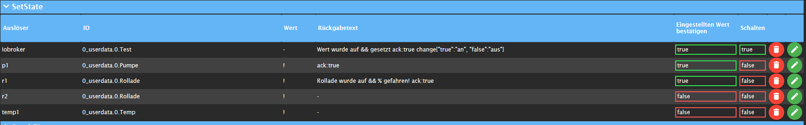
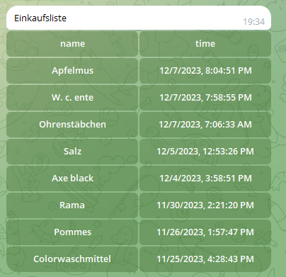

## ioBroker telegram-menu adapter

Simply create Telegram menus
The adapter serves to communicate with the iobroker by telegram menu, switch data point or values ​​of
To query data points. To do this, you can create different groups in which you can create menus. You can do this
Then assign users.

Let´s get started!

### Generally

-   All sub menu and special settings presented can be found directly in the adapter. This
    Settings are sorted and placed exactly where they can be used.
    The "helper text" can be accessed via this button
-   Important: In order for the menu to be used, at least one menu must be actively set under "Bernuter from Telegram" in the adapter. Simply put the checkbox on the right side.

### Navigation

 Here the navigation sees.

-   Line 1 (green) is the start navigation, this is sent when the adapter is started or restarted. Man
    But can call up this via a button.
-   The text on the right side "Choose an action" is freely selectable, but must not be empty.
-   Buttons in a row are with a`,`separated
-   A new line can be reached with the separator`&&`.

 Here, the menu sent in Telegram. If I now press the heating, "heating" as a text on the adapter is now
Sent, this is looking for the right call text, this must be written in this way, see in the upper picture. **Very important, every name of the call text may only occur once, i.e. it must be unique**

-   Various predefined submenus can be used, e.g. on-off, percent or numbers for e.g.
    Roller shutters control, a new trigger is automatically created in the actions, but more on that below.

-   It is possible to switch from a menu to another menu. This makes sense when two people have the same menu
    Use together, but if user1 receives an additional menu that user2 should not have access. In both
    Groups are visible to the corresponding button, but with a functionality that is only relevant for user1. With it
    This works, the respective user must be specified in both groups.

-   In order for the second menu to work, i.e. a submenu, the trigger text of the start page must be deactivated. Through
    Deactivating is shown the line in orange, and the indication that it is a submenu
    acts. You deactivate the line by leaving the cell triggered empty. In the older versions you had to`-`Enter, but continue to work with it. Now user1 from menu1 can access menu2 by
    Press the corresponding button. **Wichtig!! Auch wenn es zwei Menus sind, darf jeder Call Text nur einmal
    vorkommen!**

-   With two menus that do not have the same user, each menu may of course have an entry, for example, but not
    when jumping from one to another.

#### Should when opening a navigation ...

##### ... a status can be sent

-   In order to display the status of an ID, when calling a navigation or a submenus, the following entry can
    Text field can be used.`{status:'ID':true}`.
    ID - must be replaced by the ID to be requested.**_Breaking Change!!!_**the parameter true behind it says or the value may be changed by`change{"true":"an","false":"aus"}`Or a modified version of it. This is important if I have more than one
    I don't want to query the status in a call, I do not set the value, the values ​​are not processed cleanly. 

##### ... the value of the status can be changed

-   If the value is to be changed, e.g. from true to and false, can`change{"true":"an","false":"aus"}`used
    become

##### ...ein Wert gesetzt werden

-   Set a data point when opening navigation. The following can be used -`{set:'id':'ID',val,ack}`- ID is
    The ID of the data point in which a value is to be written. Val - the value to be set, ACK - should the value
    be confirmed or set unconfirmed?

##### ... a time stamp can be sent

-   sends a time stamp when opening a navigation
-   For the last editing`{time.lc,(DD MM YYYY hh:mm:ss:sss),id:'ID'}`
-   otherwise`{time.ts,(DD MM YYYY hh:mm:ss:sss),id:'ID'}`- ID is the ID of the data point to be requested, in the brackets
    it can be changed individually, individual placeholder can be removed, but must not change
    Being can also be used as Yy.

##### ... add a line break to the text

-   Enter the desired place \\ n

##### ... is the status worth a Unix time temple

-   To convert it at a local time -`{time}`

##### ... use the parse fashion

-   is used to text fat`<b></b>`, italics`<i></i>`also code`<code></code>`or link`<a href=“URL“>Link</a>`dar
    to be placed, it is possible that there is more
-   To use this to activate checkbox parse fashion and insert text between the tags

#### Icons in den Menu-Buttons

-   If you want to have special icons in the menu buttons, you copy an emoji (
    e.g.<https://www.getemojis.net/html/#Emoji-Liste>) and use it like a characters or simply by`Windows + .`. It is not the code of the Emoji's, but the emoji directly!

#### Delete the course

To delete all the messages (similar to "Delete the course" in the client) you add a menu item`menu:deleteAll:Navigation`- **Navigation** is the menu name that is then to be called up (
e.g. Home), only entries can be deleted that are younger than 48h.

### Sub-menus

-   The menus are entered in the navigation to access them
-   The trigger must always be a unique name, so it is only allowed to occur once and then refers to the
    Trigger in action where the ID is given.

     menu:switch-on.true-off.false:TRIGGER:

-   Every value can be replaced, on and off are the buttons, true and false automatically become booleans
    changed, but can also be replaced by text

    menu:percent10:TRIGGER:

-   The 10 is variable and indicates the steps, which can simply be replaced by another number.

    menu:number1-20-2-unit:TRIGGER:

-   The 1.20 indicates the range, which can also be turned over 20.1, which 2 the steps, easy for a negative value`(-)`Write before the number, and unit, everything can be replaced variably. e.g.`menu:number16-36-4-°C:temperaturXY:`

    menu:dynSwitch[Name1|value1, Name2|value2, value3]:TRIGGER:LengthOfRow:

-   With this, a dynamic menu can be generated in an array \[], always the name and the value to be displayed,
    Name | value, or alternatively only the value, then the button is called the value, -Lengthofrow-
    Specify how many buttons should stand next to each other.**_Breaking Change!!!_** Please change manually:`[Name1:Value1, Name2:Value2]`change`[Name1|Value1, Name2|Value2]`. Now decimal numbers can also be considered value
    be used, e.g. (2.5).
    A value of a data point can now be used as a name.`{status:'ID':true}`<a href="#status">For further
    Watch information here</a>
  
    If you leave the value empty the submenu will be set to the datapoint, otherwise the value from config will be set
    You can maybe set the submenu value to a string datapoint, the value will not change. And another datapoint with type boolean. Here the value will transformed to a boolean value.
    - false => "false" , false, 0, null, "null", undefined and "undefined"
    - true => every other value , string , number or true 

    menu:back

-   Change back to the side called in front of it, a maximum of 20 pages can be returned

     
    
    

### Setstate

-   The checkbox switches on the right, only switches booleans, it changes between the true and false when the trigger is called.
    The trigger has exactly the name of how the button that should trigger the campaign.
-   You can enter other values ​​under value so that it is set, a separate set of sets must be used for every value
    be created
-   It is possible to have the setting confirmed, **as soon as`ack:true`was set**. Placeholder
    for the value &&. Basically, all states will be with`ack:false`set, this is generally necessary
    if you want to control adapters. Confirmation is always carried out only when the addressed adapter is
    Emphasis on`ack:true`has set. But you want`ack:true`Set manually, just put the hook at ACK. 

    {novalue}`

-   If you do not want to get the value set, this will be entered in the return text  

    {"id":"id","text":"Wert wurde gesetzt:"}

-   If you want to set a state and then receive the change of another states, you use it in the return text.
    Replace ID with the desired ID, the text can also be adjusted
    However, the change is only sent when the state has been set to ACK: True

    {setDynamicValue:RequestText:Type:ConfirmText:ID:}

-   **Set a text or number data point:** If you want to write a text in a data point, for example, the
    Instance after pressing the button on an input. The selected data point then becomes the text
    described. This must be entered in the back field.
    -   "RequestText" - request text for input
    -   "Type" - boolean, number, string
    -   "Confirmtext" - Set confirmation text of the data point can be replaced with your own text.
    -   "ID" - confirmation value of another ID in the return text (is optional)

    {confirmSet:The value has been set:noValue}

-   The setting of a value can be confirmed, but this does not mean that an adapter
    processed

##### Parse Mode , change, newline

-   Please look into the navigation

#### Influence a value of a submenu

-   To achieve this, simply create the submenu as usual. Then the static part for sets as a value
    Insert and as a placeholder from the submenu`{value}`set.

#### Set a static value with a dynamic value of an ID

-   To achieve this you can define a static part and in front of it, in between or behind it one
    dynamic part. The dynamic part looks like this`{id:ID}`, whereby ID must be replaced by the desired ID,
    And the rest stays that way.

### GetState

-   With && as a placeholder you can place the value in the text, as well as with sets you can influence the value
    with`change{"true":"an", "false":"aus"}`.
-   If I want to read out a value from a data point, but has to convert the value, I can go to the return text`{math:/10}`For example, 10 is shared here 
-   If you want to round the value, the following goes`{round:2}`
-   If you want to call up several values ​​with a query at the same time, you can activate the Checkbox NewLine to for
    Each query displayed the return text in a new line.
-   If you want a value to convert a states with Unix-time temple at a local time
    In the return text`{time}`At the desired place one

#### Values ​​from the functions created

-   In order to get all the values ​​of the adjustable functions, you have to just have functions = light, e.g.
    write.
-   If you want to have the name of the data point in the output text, simply wear the desired position in the text`{common.name}`a

 

-   **Table** Or display a JSON display: Select a data point under ID that contains a JSON. In addition in the text field`{json;[value-1-inJSON:NameTH-Col1,value-2-inJSON:NameTH-Col1];Header;}`input. **Value-1** is e.g. the
    First key of the JSON, which is to be displayed. **NameTH-Col1** forgives the associated
    Column names (etc.), this can also be left away, then the table has no header. **Header** Must be filled out and is the heading for the table. Output in text format (deactivated parse fashion): '
    {Json;[value-1-inJSON:NameTH-Col1,value-2-inJSON:NameTH-Col1]; Header; Textable;} '. The number of columns is free
    Definable - e.g.`value-3-inJSON:NameTH-Col3`add.

    {json;[value-1-inJSON:NameTH-Col1,value-2-inJSON:NameTH-Col1];Header;shoppinglist;}

-   This creates exactly the same list.
    Remove adapter. The key for the data from the JSON is in this case`name:`.Damit the whole thing has to
    The data point from which the list was created, the data point of the`alexa-shoppinglist`Adapt breast.

### Send Picture

-   In the settings you can insert a token for Grafana
-   A directory must be created in which you have all the writing back e.g.`/opt/iobroker/grafana/`to do the
    To be able to save pictures between
-   In action you have to specify the rendering URL, this can be found in Grafana on the diagram -> share -> (time area
    Remove lock so that the current diagram is always sent) -> Direct link to the rendered picture
-   If you send several diagrams, the filen name must be different, otherwise the pictures are mutually
    overwrite
-   Delay The time between the request and the sending of the image -> depending on the speed of the system
    other value

    

### Send Location

-   Select the first trigger
-   Then a data point for the latitude ("Latitude") and one for the length of the length ("Longitude") must be specified

### Events

-   Integrated event lister: waiting for a data point - this data point is set (e.g. via script or
    Adapter), a predefined menu is opened. It is checked for the condition and on the field, which one for each
    Can enter event separately.

### Echarts

-   This makes it possible to have diagrams sent directly from the Echharts adapter.
-   Preset can be adopted directly from the object structure.
-   Background, as the name suggests, the background can be set here
-   Theme, different themes can be set from the Echharts adapter, e.g.`auto, default, dark, dark-bold, dark-blue, gray, vintage, macarons, infographic, shine, roma, azul, blue, royal, tech-blue, red, red-velvet, green`
-   File name, individual file name. **It is important that a directory is given in the settings with
    full of writing authorization**

### HTTP Request

-   This makes it possible to send an HTTP Request AB, with and without authentication. First of all, the URL has to
    are given, users and password are optional if they are not required simply leave empty. As a file name
    the preliminary name can stop.

### Settings

-   Telegram instance, here you can choose between the instances if you have installed several
-   The text of the input field "Text is sent if no entry has been found!" is sent, like the description
    Already says if no entry has been found, this can be deactivated by the checkbox.
-   Resize keyboard - asks customers to change the size of the keyboard vertically in order to make an optimal fit too
    ensure (e.g. to make the keyboard smaller if there are only two rows of key). The default value is
    "False". In this case, the custom keyboard always has the same height as the standard keyboard of the
    App.<https://core.telegram.org/bots/api#replykeyboardmarkup>
-   One Time Keyboard - asks clients to hide the keyboard as soon as it is used. The keyboard will
    continue to be available, but clients automatically indicate the usual letter keyboard in chat - the user
    Can press a special button in the input field to display the custom keyboard again. The
    The default value is "false".<https://core.telegram.org/bots/api#replykeyboardmarkup>
-   Token Grafana - optional, token to call diagram from Grafana
-   Directory - To save diagrams between, is used for Grafana and also for icharts, it has to be full
    Consistence authorization for this directory
-   Send menu after a restart - or after saving can be deactivated here, if necessary the menu must
    for the first time by input in the input field in the Telegram app
