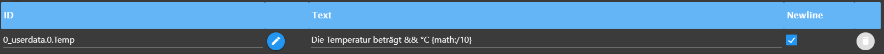

## ioBroker telegram-menu adapter

Easily create Telegram menus
The adapter is used to communicate with the Iobroker via Telegram menu, to switch data points or values
query data points. To do this, you can create different groups in which you can create menus. You can do this
then assign users.

Let´s get started!

### Generally

-   All submenus and special settings presented below can be found directly in the adapter. This one
    Settings are sorted and placed exactly where they can be used.
    You can use this button to call up the “HelperText”.
-   Important: In order for the menu to be used, at least one menu must be activated under "Bernuter from Telegram" in the adapter. To do this, simply check the checkbox on the right.

### Navigation

<br>Here you can see the navigation.

-   Line 1 (green) is the start navigation, this is sent when the adapter is started or restarted. Man
    but you can call this up again using a button.
-   The text on the right "Choose an action" is freely selectable, but cannot be empty.
-   Buttons in a row are marked with a`,`separated
-   A new line can be reached with the separator`&&`.

<br>Here, the menu sent in Telegram. For example, if I now press heating, “Heating” is sent to the adapter as text
sent, this looks for the appropriate call text, it must be written exactly as shown in the picture above. **Very important, each name of the call text may only appear once, i.e. it must be unique**

-   Various predefined submenus can be used, e.g. on-off, percent or numbers for e.g
    Roller shutter control, a new trigger is automatically created in the actions, but more on that below.

-   It is possible to switch from one menu to another menu. This makes sense when two people share the same menu
    share, but if User1 gets an additional menu that User2 should not have access to. In both
    The corresponding button is visible to groups, but with functionality that is only relevant for User1. With that
    For this to work, the respective user must be specified in both groups.

-   In order for the second menu, i.e. a submenu, to work, the trigger text on the home page must be deactivated. Through
    If you deactivate it, the line will be displayed in orange and a message will appear indicating that it is a submenu
    acts. You deactivate the line by leaving the Trigger cell empty. In the older versions you had to`-`enter, but it still works with it. Now User1 can access Menu2 from Menu1 by clicking on the
    presses the corresponding button. **Important!! Even if there are two menus, each call text can only be used once
    occur!**

-   If there are two menus that do not have the same user, each menu can of course have an entry, for example light, but not
    when jumping from one to the other.

#### When opening a navigation...

##### <span id="status"></span>...a status will be sent

-   To display the status of an ID when calling up a navigation or a submenu, you can enter the following entry in the
     Return text can be used.`{status:'ID':true}`.
     ID - must be replaced with the ID to be queried.`Es muss direkt an die Stelle gepackt werden wo der Status angezeigt werden soll`
-   **_Breaking Change!!!_**the parameters`true`behind it says whether the value can be changed by`change{"true":"an","false":"aus"}`. This is important if you have more than one
    want to query status in one call.<br>

##### ... the value of the status can be changed

-   If the value is to be changed, e.g. from true to on and false to off, can`change{"true":"an","false":"aus"}`used
    become

##### ...a value can be set

-   sets a data point when opening a navigation. The following can be used -`{set:'id':'ID',val,ack}`- ID is
    the ID of the data point into which a value is to be written. val - the value to be set, ack - the value should be
    be set confirmed or unconfirmed?

##### ...a timestamp will be sent

-   sends a timestamp when opening a navigation
-   for final processing`{time.lc,(DD MM YYYY hh:mm:ss:sss),id:'ID'}`
-   otherwise`{time.ts,(DD MM YYYY hh:mm:ss:sss),id:'ID'}`- ID is the ID of the data point to be queried, in the brackets
    It can be changed individually, individual placeholders can be removed, but may not be changed
    except YYYY can also be used as YY.

##### ...add a line break to the text

-   Enter \\n at the desired location

##### ...the status value is a Unix timestamp

-   to convert this to a local time -`{time}`

##### ...use parse mode

-   is used to make text bold`<b></b>`, italics`<i></i>`also code`<code></code>`or link`<a href=“URL“>Link</a>`represents
    To ask, it is possible that there are more
-   to use the checkbox Enable Parse Mode and insert text between the tags

#### Icons in den Menu-Buttons


-   If you want to have special icons in the menu buttons, copy an emoji (
    e.g.<https://www.getemojis.net/html/#Emoji-Liste>) and uses it like a character or simply via`Windows + .`. The code of the emoji is not copied, but the emoji directly!


#### Clear history

To delete all messages (similar to "Delete history" in the client), add a menu item`menu:deleteAll:Navigation`- **Navigation** is the menu name that should then be called up (
e.g. Home page), only entries that are younger than 48 hours can be deleted.

### Sub-menus


-   The menus are entered into the navigation in order to call them up
-   The TRIGGER must always be a unique name, so it can only appear once and then refers to it
    Trigger in action where the ID is specified.


     menu:switch-on.true-off.false:TRIGGER:

-   Any value can be replaced, on and off are the buttons, true and false automatically become booleans
    converted, but can also be replaced with text


    menu:percent10:TRIGGER:

-   The 10 is variable and indicates the steps; this can easily be replaced by another number.


    menu:number1-20-2-unit:TRIGGER:

-   The 1.20 indicates the range, this can also be reversed to 20.1, the 2 the steps, for a negative value simply`(-)`write in front of the number and Unit the unit, everything can be replaced variably. e.g.`menu:number16-36-4-°C:temperaturXY:`


    menu:dynSwitch[Name1|value1, Name2|value2, value3]:TRIGGER:LengthOfRow:

-   This can be used to create a dynamic menu, in an array \[], always the name to be displayed and the value,
    Name|Value, or alternatively just the value, then the button is designated with the value, -LengthOfRow- with this you can
    Specify how many buttons should be next to each other.**_Breaking Change!!!_** Please change manually:`[Name1:Value1, Name2:Value2]`change to`[Name1|Value1, Name2|Value2]`. Decimal numbers can now also be used as values
    can be used, e.g. (2.5).
    A value of a data point can now also be used as a name.`{status:'ID':true}`<a href="#status">for more
    See information here</a>


    menu:back

-   Goes back to the previous page, you can go back a maximum of 20 pages

    <br>
    
    

### SetState


-   The Switch checkbox on the right only switches booleans, it switches between true and false when calling the trigger.
    The trigger has exactly the same name as the button that is supposed to trigger the action.
-   Under Value you can enter other values so that they can be set; a separate SetState must be used for each value
    be created
-   It is possible to have the setting of the value confirmed, **as soon as`ack:true`was set**. Placeholder
    for the value is &&. Basically all states will be included`ack:false`set, this is fundamentally required
    if you want to use it to control adapters. A confirmation always only occurs when the addressed adapter
    Value up`ack:true`has set. But you would like to`ack:true`If you set it manually, you simply check the box next to Ack.<br>

* * *

    {novalue}

-   If you do not want to receive the set value, this will be entered in the return text<br><br>

* * *

-   If you set a state but then want to receive the change of another state, you use this in the return text.
    Replace ID with the desired ID, the text can also be customized
    However, the change is only sent if the state was set to ack:true

## Note - there has been a change here

In most cases the change should have been applied automatically, please check whether it works as desired.

### Neu

```
 {"foreignId":"id","text":"Wert wurde gesetzt:"} 

```

<details>
  <summary>Alte Version anzeigen (ausklappbar)</summary>

### Old (obsolete)

     {'id':'ID','text':'Wert wurde gesetzt:'} 

## </details>

    {setDynamicValue:RequestText:Type:ConfirmText:ID:}

-   **To set a text or number data point:** For example, if you want to write text to a data point, it waits
    Instance after pressing the button on an input. The selected data point is then displayed with the text
    described. This must be entered in the return field.
    -   "RequestText" - request text for input
    -   "Type" - boolean, number, string
    -   "ConfirmText" - set confirmation text of the data point, can be replaced with your own text.
    -   "ID" - confirmation value of another ID in the return text (is optional)

* * *

    {confirmSet:The value has been set:noValue}

-   This can be used to confirm the setting of a value, but this does not mean that an adapter has this value
    processed

* * *

##### Parse Mode , change, newline

-   please look in the navigation

#### Influence a value from a submenu

-   To achieve this simply create the submenu as usual. Then with SetState the static part as the value
    insert and as a placeholder from the submenu`{value}`set.

#### Set a static value with a dynamic value of an ID

-   To achieve this you can define a static part and one in front of it, in between or behind it
    dynamic part. The dynamic part looks like this`{id:ID}`, where ID must be replaced by the desired ID,
    and the rest stays that way.

#### Here are a few examples

Input, the value of the ID in this case has the value true or false:

    {id:0_userdata.0.Fenster.Fenster_Status} 

Output:

    true 

Input, the value of the ID in this case has the value 5, is then multiplied by 2:

    {id:0_userdata.0.Count} {math:*2} 

Output:

    10

Input, the value of the ID in this case has the value 5, is then multiplied by 2. With additional text:

    Test {id:0_userdata.0.Count} {math:*2} Test 

Output the value is always appended at the end, unless you use the placeholder &&:

    Test Test 10

Input, the value of the ID in this case has the value 5, is then multiplied by 2. With additional text:

    Test && {id:0_userdata.0.Count} {math:*2} Test  Oder Test && Test {id:0_userdata.0.Count} {math:*2}

Output of the placeholders is replaced by the value:

    Test 10 Test

Input, you can also change the result, state the id still has the value 5:

    Status &&  {id:0_userdata.0.Count} {math:*2} change{"10":"an", "20":"aus"}

Output of the placeholders is replaced by the value:

    Status an

* * *

### GetState

-   With && as a placeholder you can place the value in the text, just like with setState you can influence the value
    with`change{"true":"an", "false":"aus"}`.
-   If I want to read a value from a data point, but have to convert the value, I can put it in the return text`{math:/10}`for example, here we divide by 10<br>
-   If you want to round the value, do the following`{round:2}`
-   If you want to retrieve multiple values at the same time with one query, you can activate the Newline checkbox to
    every query to get the return text displayed on a new line.
-   If you want to convert a value from a state with a Unix timestamp to a local time and have it sent, add
    in the return text`{time}`at the desired location

#### Values ​​from created functions

-   To get all the values of the adjustable functions, you simply have to use functions=Light instead of the ID, e.g.
    write.
-   If you want to have the name of the data point in the output text, simply enter it at the desired position in the text`{common.name}`a

<br>

-   **The table**<br>or display a JSON: under ID select a data point that contains a JSON. In the text field`{json;[value-1-inJSON:NameTH-Col1,value-2-inJSON:NameTH-Col1];Header;}`input. **Value-1** is e.g
    first key of the JSON that should be displayed. **NameTH-Col1** assigns the corresponding one
    Column names (etc.), This can also be omitted, then the table has no header. **Header** must be filled out and is the heading for the table. Output in text format (parse mode disabled): '
    {json;[value-1-inJSON:NameTH-Col1,value-2-inJSON:NameTH-Col1];Header;TextTable;}'. The number of columns is free
    definable - e.g.`value-3-inJSON:NameTH-Col3`add.


    {json;[value-1-inJSON:NameTH-Col1,value-2-inJSON:NameTH-Col1];Header;shoppinglist;}

-   This creates exactly the same list, here the buttons have the function of the item from the Alexa2 list
    Remove adapter. In this case, the key for the data from the JSON is`name:`. In order for the whole thing to work, it has to
    the data point from which the list was created, the data point of the`alexa-shoppinglist`Adapt breast.


### Send Picture

-   You can insert a token for Grafana in the settings
-   A directory must be created in which you have all write permissions, e.g.`/opt/iobroker/grafana/`to get there
    To be able to temporarily save images
-   In action you have to specify the rendering URL, which can be found in Grafana on the diagram → share → (time range
    Remove the lock so that the current diagram is always sent) → Direct link to the rendered image
-   If you send several diagrams, the file name must be different, otherwise the images will be mutually exclusive
    overwrite
-   `Neuerung!!!`From now on you have the option to set the delay to 0, so the image will be sent without delay.
-   With Delay, it will be sent delayed by the value. Time between request and sending the image in seconds.

    

### Send Location

-   select trigger first
-   then one data point must be specified for latitude and one for longitude

### Events

-   Integrated event listener: Waits for a data point - this data point is set (e.g. via script or
    Adapter), a predefined menu is opened.
-   ... it is checked for the condition,
-   ... from version > 1.7.3, you can select "=", "!=", "&lt;", ">", "&lt;=", ">=" as a condition, if this is not selected, it will
    checked for equality by default.
-   ... it is checked for Ack,

### Echarts

-   This makes it possible to have diagrams sent directly from the Echarts adapter.
-   Preset can be taken directly from the object structure.
-   Background , as the name suggests, the background can be set here
-   Theme, different themes can be set from the Echarts adapter, e.g.`auto, default, dark, dark-bold, dark-blue, gray, vintage, macarons, infographic, shine, roma, azul, blue, royal, tech-blue, red, red-velvet, green`
-   Filename, individual filename. **It is important that a directory is specified in the settings
    full write permission**

### HTTP Request

-   This makes it possible to send an Http request, with or without authentication. First of all, the Url
    must be specified, user and password are optional, if they are not needed simply leave them blank. As a file name
    the preconfigured name can remain.

### Settings

-   Telegram instance, here you can choose between the instances if you have several installed
-   The text of the input field "Text will be sent if no entry was found!" will be sent as the description
    already says if no entry was found, this can be deactivated using the checkbox next to it.
-   Resize Keyboard - Prompts customers to resize the keyboard vertically for an optimal fit
    (e.g. making the keyboard smaller if there are only two rows of keys). The default value is
    “false”. In this case, the custom keyboard will always have the same height as the default keyboard
    app.<https://core.telegram.org/bots/api#replykeyboardmarkup>
-   One Time Keyboard - Prompts clients to hide the keyboard once it is in use. The keyboard will
    will still be available, but clients will automatically display the usual letter keyboard in the chat - the user
    can press a special button in the input field to display the custom keyboard again. The
    Default value is “false”.<https://core.telegram.org/bots/api#replykeyboardmarkup>
-   Token Grafana - Optional, token to retrieve graph from Grafana
-   Directory - to temporarily store diagrams, is needed for Grafana and also for Echarts, it must be full
    You have write permission for this directory
-   Send menu after a restart - or after saving can be deactivated here, if necessary the menu has to be sent
    can be accessed for the first time by typing in the input field in the Telegram app
